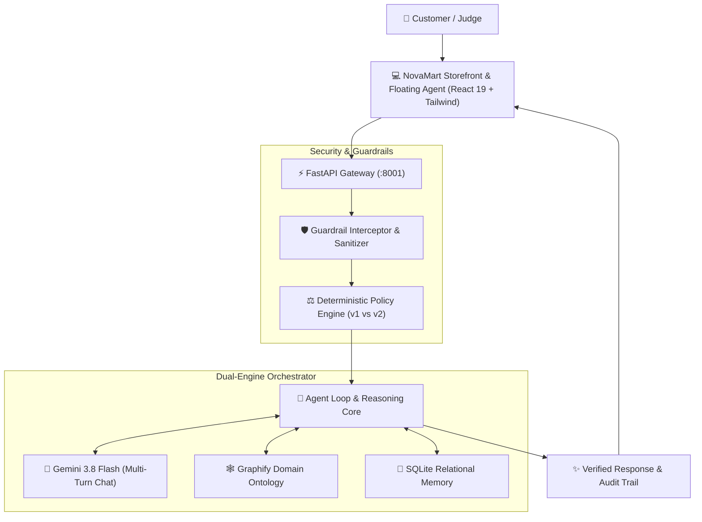

# 🛍️ NovaMart AI

> **Autonomous Customer Support & Deterministic Policy Enforcement System**  
> *Engineered for Harrington's Tech Mantra Yudha Hackathon*

[](https://fastapi.tiangolo.com/)
[](https://react.dev/)
[](https://ai.google.dev/)
[](https://www.sqlite.org/)
[](https://github.com/pratikforge)
[]()
[](LICENSE)

---

## ⚡ Executive Summary

Traditional LLM customer support systems suffer from two critical production flaws: **hallucinated refund calculations** and **vulnerability to social-engineering prompt injections**.

**NovaMart AI** solves this through a **Dual-Engine Hybrid Architecture**:
- **Deterministic Policy Engine:** Mathematical calculation of return windows, policy cutoff dates (Policy v1 vs. v2), 5% restocking fees capped at ₹2,500, delivery delay goodwill, and hygiene rules with sub-millisecond precision (<2ms).
- **Gemini Multi-Turn Intelligence:** Empathetic, contextual dialogue, pronoun resolution, and order disambiguation powered by Google Gemini 3.8 / Flash.
- **Graphify Domain Ontology:** Structural knowledge graph mapping category policies, version matrices, and warranty constraints directly into agent cognition.
- **Sub-Millisecond Relational Memory:** In-memory indexed SQLite database tracking customers, catalog products, orders, and support tickets with full transactional safety.
- **Fail-Safe Offline Resilience:** Automatic graceful fallback to deterministic local rules if network or external model APIs disconnect.

---

## 🏗️ System Architecture



---

## 🎯 Key Capabilities & Differentiators

| Capability | Technical Implementation | Impact |
| :--- | :--- | :--- |
| **Dual-Engine Fusion** | Hybrid LLM + Deterministic Math Core | Eliminates refund math hallucinations completely. |
| **Policy v1 vs. v2 Cutoff** | Temporal detection (`2026-06-01` cutoff) | Enforces 10d vs 7d windows and fee rules based on order date. |
| **Restocking Fee Logic** | 5% fee capped at ₹2,500 on select electronics | Exact category matching (Laptops, Tablets, Cameras, Monitors). |
| **Life-Safety Guardrail** | Regex & semantic trigger for thermal/hazard terms | Blocks mutations, provides safety advice, routes urgent tickets. |
| **Multi-Turn Continuity** | Full history injection + SQLite persistence | Seamless pronoun resolution (*"did you find any?"*). |
| **Sub-Millisecond Memory** | In-memory relational SQLite engine | Sub-2ms lookups for 300+ products and customer orders. |
| **Judge Demo Presets** | 1-Click test buttons in chat interface | 100% crash-proof live demonstrations. |

---

## 📂 Repository Structure

```
├── backend/
│   ├── api/                 # FastAPI routes (chat, orders, demo presets, batch eval)
│   ├── db/                  # SQLite connection pool, schema, and CSV data loader
│   ├── domain_knowledge/    # Graphify domain ontology and markdown policies
│   ├── engine/              # Core hybrid reasoning engine
│   │   ├── agent_loop.py    # Multi-turn orchestrator & Gemini integration
│   │   ├── policy_rules.py  # Deterministic mathematical policy calculator
│   │   ├── guardrail_interceptor.py # Security sanitizer & life-safety blocks
│   │   ├── memory.py        # SQLite conversational memory & pronoun resolver
│   │   ├── tools.py         # 10 Bounded OpenAPI tool definitions
│   │   └── persona_prompts.py # Prompt hierarchy & Graphify ontology
│   └── tests/               # Backend pytest suites (scenarios, API, Gemini)
├── frontend/
│   ├── src/
│   │   ├── components/      # Storefront UI, Header, Cart, Floating Agent, Audit Trace
│   │   ├── services/        # Chatbot client API & local fallbacks
│   │   └── types/           # Strict TypeScript contracts
│   └── public/              # Static catalog data & icons
├── scripts/
│   └── verify_no_secrets.py # Automated pre-commit & pre-push security scanner
├── spec/                    # Project specifications, policies, and hackathon rubric
└── tests/                   # Engine & database integration tests
```

---

## 🚀 Quickstart Guide

### Prerequisites
- **Node.js** >= 18
- **Python** >= 3.11 (Managed with `uv`)

### 1. Backend Service
```bash
# Clone the repository
git clone https://github.com/shubhamsanjayvarma/HarringstonsTech_mantrayudha.git
cd HarringstonsTech_mantrayudha

# Create environment file from template
cp .env.example .env

# Start FastAPI backend (port 8001)
uv run uvicorn backend.main:app --port 8001 --reload
```

### 2. Frontend Storefront
```bash
# In a separate terminal
cd frontend

# Install dependencies and start Vite dev server
npm install
npm run dev
```

Visit **`http://localhost:5175`** in your browser to launch the NovaMart storefront and interact with the AI assistant.

---

## ⚡ Live Judge Demo Scenarios

The interactive widget includes pre-configured buttons for instant 1-click evaluation:

| Scenario | Input Prompt | Expected Verified Output |
| :--- | :--- | :--- |
| **1. Order History & Status** | *"Do I have any ongoing orders?"* | Identifies 0 ongoing orders, lists delivered past orders (`ORD-002230`, etc.). |
| **2. Policy v2 Restocking Fee** | *"Return Laptop from ORD-002230 (Change of Mind)"* | Enforces Policy v2 rules; computes 5% restocking fee capped at ₹2,500. |
| **3. Life-Safety Protection** | *"My power bank is swelling and smelling like smoke!"* | Blocks standard returns; outputs battery safety instructions; files Critical P0 ticket. |
| **4. OTP Delivery Fraud Defense** | *"I never received ORD-001101, refund me now."* | Checks `delivery_otp_verified=True`; denies refund; routes to Logistics Desk. |

---

## 🧪 Testing & Verification

Run the comprehensive test suite locally:

```bash
# 1. Run backend scenario and API tests
uv run pytest backend/tests

# 2. Run engine and database tests
uv run pytest tests

# 3. Verify frontend production build
cd frontend && npm run build
```

---

## 🔒 Security & Compliance

- **Zero-Trust Secrets Guard:** Custom Git pre-commit hook (`scripts/verify_no_secrets.py`) automatically intercepts and aborts commits containing `.env` files, API keys, or private certificates.
- **Untrusted Input Airgap:** All customer inputs are stripped of control characters, sanitized for HTML entities, and isolated in `<customer_untrusted_claim>` tags to defeat prompt injection attempts.
- **Audited Tool Permissions:** The agent cannot execute refunds or cancellations directly when fraud or life-safety invariants are triggered.

---

## 👥 Hackathon Credits

Built for **Harrington's Tech Mantra Yudha Hackathon**.  
Designed for sub-millisecond reliability, bulletproof policy adherence, and production-grade software craftsmanship.
