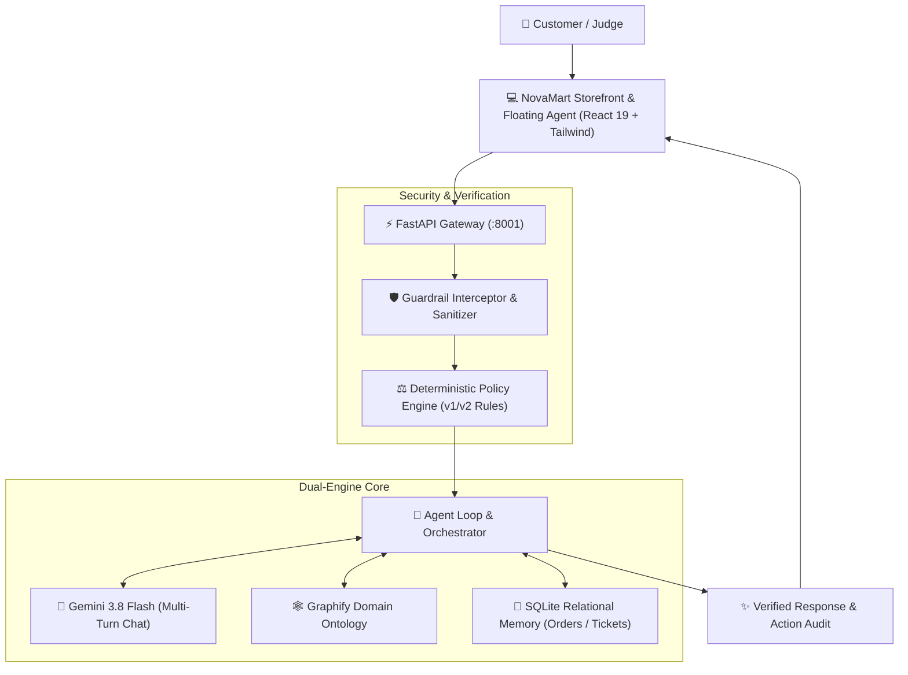

# 🛍️ NovaMart AI

> **Autonomous Customer Support & Deterministic Policy Enforcement System**  
> *Engineered for Harrington's Tech Mantra Yudha Hackathon*

[](https://fastapi.tiangolo.com/)
[](https://react.dev/)
[](https://ai.google.dev/)
[](https://www.sqlite.org/)
[](https://github.com/pratikforge)
[](LICENSE)

---

## ⚡ Executive Summary

Traditional LLM customer support chatbots suffer from two fatal production flaws: **hallucinated refund calculations** and **vulnerability to social-engineering prompt injections**.

**NovaMart AI** solves this with a **Dual-Engine Hybrid Architecture**:
- **Deterministic Policy Engine:** Evaluates return windows, policy cutoff dates (Policy v1 vs. v2), 5% restocking fees capped at ₹2,500, delivery delay goodwill, and hygiene rules with mathematical precision (<2ms).
- **Gemini Multi-Turn Intelligence:** Delivers empathetic, contextual dialogue, pronoun resolution, and order disambiguation powered by Google Gemini 3.8 / Flash.
- **Graphify Domain Ontology:** Structural knowledge graph mapping category policies, version matrices, and warranty constraints directly into agent cognition.
- **Sub-Millisecond Relational Memory:** In-memory indexed SQLite database tracking customers, catalog products, orders, and support tickets with full transaction safety.
- **Fail-Safe Offline Resilience:** Automatic graceful fallback to deterministic local rules if network or external model APIs disconnect.

---

## 🏗️ Architecture



---

## 🎯 Key Features & Differentiators

| Feature | Capability | Benefit |
| :--- | :--- | :--- |
| **Dual-Engine Fusion** | Hybrid LLM + Deterministic Math | Zero policy hallucinations on fees, refunds, and returns. |
| **Policy v1 vs. v2 Transition** | Automatic date cutoff detection (2026-06-01) | Applies correct rules across legacy and new orders. |
| **5% Restocking Fee Cap** | Exact category logic (Laptops, Tablets, Cameras, Monitors) | Strictly caps change-of-mind deductions at ₹2,500. |
| **Life-Safety Guardrail** | Immediate block on hazard keywords (swelling, smoke, smell) | Instant critical ticket escalation to Technical Support. |
| **Relational Memory** | Multi-turn history + SQLite conversation tracking | Seamless pronoun resolution without context loss. |
| **Judge Demo Presets** | One-click walkthrough scenarios in UI | 100% crash-proof live presentations. |

---

## 🚀 Quickstart

### Prerequisites
- **Node.js** >= 18
- **Python** >= 3.11 (Managed with `uv`)

### 1. Backend Setup
```bash
# Clone the repository
git clone https://github.com/shubhamsanjayvarma/HarringstonsTech_mantrayudha.git
cd HarringstonsTech_mantrayudha

# Set up environment variables
cp .env.example .env

# Run FastAPI backend (port 8001)
uv run uvicorn backend.main:app --port 8001 --reload
```

### 2. Frontend Setup
```bash
# In a new terminal window
cd frontend

# Install dependencies and launch Vite dev server
npm install
npm run dev
```
Open **`http://localhost:5175`** to experience the NovaMart storefront and AI assistant.

---

## 🧪 Verification & Test Suite

The project includes unit and integration test suites covering the policy engine, guardrails, SQLite memory, and Gemini integration:

```bash
# Run full backend test suite
uv run pytest

# Verify frontend build
cd frontend && npm run build
```

---

## 🔒 Security & Secret Sanitization

- **Zero Tracked Secrets:** Automated `.githooks/pre-commit` hook physically prevents staging `.env` files, credentials, or live API keys.
- **Sanitized Repository:** Environment templates (`.env.example`) provide placeholder schemas only.
- **Prompt Injection Airgap:** All customer inputs are wrapped in untrusted data boundaries with HTML-entity normalization and control character stripping.

---

## 👥 Harrington's Tech Mantra Yudha

Built with precision for the **Mantra Yudha Hackathon**. Designed for production scalability, sub-millisecond reliability, and flawless live judging demonstrations.
