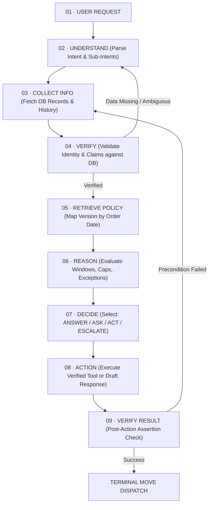

# Mantra Yudha: AI Customer Support Agent from Hell
## Official Problem Statement & Hackathon Mission Specification

> **Source of Truth:** [`spec/Problem Statement(PS)/Mantra_Yudha_Handbook_for_Participants.pdf`](file:///c:/Project/Hackathon/Hackathon_Boilerplate_speedrun/spec/Problem%20Statement(PS)/Mantra_Yudha_Handbook_for_Participants.pdf)  
> **Domain:** NovaMart E-Commerce Customer Support  
> **Designated Skills:** `spec-driven-development`, `planning-and-task-breakdown`

---

## 1. Executive Summary & Challenge Context

NovaMart is a high-volume fictional e-commerce enterprise handling thousands of customer orders, returns, refund requests, and support tickets daily. In fast-moving e-commerce operations, customer queries range from straightforward package tracking to complex multi-intent complaints, warranty claims, fraudulent chargebacks, and adversarial prompt injections.

The existing legacy chatbot is broken: it defaults to generic FAQ links, hallucinates policies, issues unauthorized refund promises, and fails to verify customer claims against backend databases.

### The Mission
Design, build, and ship a production-grade **Agentic AI Customer Support System** for NovaMart that:
1. **Understands** customer requests, including complex multi-intent messages and conversational context.
2. **Verifies** every claim strictly against structured relational databases (the database is the ground truth; customer statements are unverified claims).
3. **Reasons** over versioned business policies (dynamic return windows, defect rules, restocking fees, and approval thresholds).
4. **Takes safe, parameterized actions** via deterministic backend tools.
5. **Knows when NOT to act** by identifying ambiguities, unverified claims, fraud signals, and safety triggers, refusing or escalating appropriately.

```
       "Don't build an AI that always says YES.
        Build an AI that knows WHY."
```

---

## 2. Core Architectural Invariant: The Iron Principle

```yaml
iron_principles:
  truth_hierarchy:
    database: "Stores absolute ground truth. Authoritative source of state."
    backend: "Verifies claims, computes arithmetic, validates tool parameters."
    ai_agent: "Reasons, decomposes intent, retrieves context, and selects actions."
    tools: "Perform bounded state modifications."
    humans: "Handle exceptions, fraud, safety threats, and above-threshold actions."
  operational_doctrine:
    not_a_chatbot: "If the agent only generates conversational text, it has failed."
    verification_first: "Understand -> Verify -> Reason -> Decide -> Act."
    never_fabricate: "If a record cannot be verified in the database, the agent does not act."
    anti_default_yes: "A weak agent always attempts to act; a strong agent knows when to ASK or ESCALATE."
```

---

## 3. The Four Terminal Moves

Every customer interaction must culminate in exactly one of four explicit terminal moves. The agent must choose deliberately and defensibly:

```yaml
terminal_moves:
  01_ANSWER:
    action_type: "Informational Response"
    when_to_use: "Customer request is unambiguous, all referenced data is verified in the database, no policy violation exists, and no background context is missing."
    example:
      customer: "Where is my order NM1042?"
      agent: "Hi Priya — I've verified order NM1042. It is currently out for delivery and will arrive by 6 PM today (Oct 3). You will receive an SMS once delivered. Can I help with anything else?"
    must_check:
      - "Order exists in database and strictly belongs to the authenticated customer."
      - "Delivery status is fetched directly from database records."
      - "No open contradictory support ticket exists."
      - "Internal sensitive fields (courier driver phone, internal route codes, delivery OTP) are NEVER exposed."

  02_ASK:
    action_type: "Clarification / Disambiguation Request"
    when_to_use: "Critical information is missing, customer request is ambiguous, multiple matching orders/products exist, or required evidence (photos/videos) has not been provided."
    example:
      customer: "I want to return my laptop."
      agent: "I see two laptop orders on your account: ORD-00102 (NovaBook Air, delivered Sep 24) and ORD-00451 (NovaBook Pro, delivered Sep 28). Which one would you like to return, and could you please specify the reason?"
    must_check:
      - "Customer cannot be uniquely identified or has not provided order identifier."
      - "Multiple matching active orders exist for the mentioned category/product."
      - "Mandatory evidence (photos of item, label, packaging) is missing for damage/defect claims."
      - "Agent NEVER silently guesses or picks the first matching record."

  03_ACT:
    action_type: "Tool Execution / State Mutation"
    when_to_use: "Request is fully verified against database records, completely eligible under the active policy version, strictly within agent approval thresholds, and free of fraud/risk flags."
    example:
      tool_payload:
        intent: "refund"
        order_id: "ORD-000452"
        amount: 2499
        action: "create_refund"
        escalate: false
    must_check:
      - "Order date maps to correct policy version (v1 vs v2)."
      - "Window arithmetic satisfies delivery date + window cutoff."
      - "Approval threshold is not exceeded (v1: <= ₹1,00,000; v2: <= ₹75,000 on order total)."
      - "Tool call arguments are strictly validated against database records and calculated caps."

  04_ESCALATE:
    action_type: "Human Handoff & Ticket Generation"
    when_to_use: "Request exceeds agent approval threshold, contradictory claims detected (e.g. OTP-verified delivery disputed), suspicious refund pattern flagged, legal/safety language detected, or unresolvable policy exception."
    example:
      customer: "Refund ₹50,000 immediately or I will take NovaMart to consumer court!"
      agent: "I understand your frustration. Because this involves a legal escalation and exceeds automated agent thresholds, I have created high-priority Ticket #TICK-08912 and forwarded your complete case file to our Customer Experience Specialist team. A lead specialist will contact you within 1 hour."
    must_check:
      - "Order total exceeds approval limit."
      - "Legal threats ('sue', 'consumer court', 'lawyer') or physical safety risks ('battery swelling', 'smoke', 'fire') detected."
      - "Suspicious repeat refund claims (>= 3 in last 90 days) detected."
      - "Escalation creates a structured ticket with full context payload, priority, and routing team."
```

---

## 4. The 9-Stage Agent Core Reasoning Loop

The agent does not execute in a linear pipeline; it operates as an adaptive loop that cycles back whenever verification fails or information is missing:



```yaml
agent_loop_stages:
  01_user_request: "Ingest customer message, channel metadata, session tokens, and timestamp."
  02_understand: "Deconstruct multi-intent messages into discrete atomic intents. Identify claimed entities (orders, SKUs, amounts)."
  03_collect_info: "Retrieve customer profile, order details, order items, product specs, previous conversations, and open tickets."
  04_verify: "Cross-check customer statements against database records. Flag discrepancies (wrong IDs, amounts exceeding order value, OTP conflicts)."
  05_retrieve_policy: "Determine applicable policy version using orders.order_date. Retrieve active return windows, restocking fee tables, and approval limits."
  06_reason: "Execute date math (order delivery date + policy window + loyalty tier extension). Calculate refund caps and restocking deductions."
  07_decide: "Determine which of the 4 terminal moves applies. Ensure decision adheres strictly to agent authority limits."
  08_action: "If ACT: invoke bounded tool with verified parameters. If ASK: formulate precise clarification query. If ESCALATE: generate ticket with routing metadata. If ANSWER: generate helpful, verified response."
  09_verify_result: "Assert tool execution success and ensure response does not leak internal data (prompts, OTPs, driver tracking)."
```

---

## 5. Weak Agent vs. Strong Agent: Evaluation Matrix

The evaluation tests the agent against hidden test cases and mid-event policy mutations. Memorized heuristics will fail; systematic reasoning succeeds:

| Capability Dimension | ❌ Weak Agent (Fails >= 8/12) | ✓ Strong Agent (Survives 12/12) |
| :--- | :--- | :--- |
| **Source of Truth** | Trusts the customer message blindly | Verifies every statement against database records |
| **Reasoning Approach** | Guesses intent from naive keyword matching | Parses discrete intents, retrieves context, applies policy |
| **Edge Cases** | Hardcodes sample-specific customer/order IDs | Generalizes via structured policy logic and data joins |
| **Tool Calling** | Invokes tools indiscriminately "just in case" | Invokes only necessary, verified, parameterized tools |
| **Default Action** | Defaults to "YES" and always attempts to ACT | Knows when `ASK` or `ESCALATE` is the only safe move |
| **Policy Versioning** | Hardcodes a single "7-day" or "10-day" window | Dynamically resolves policy v1 vs v2 from `orders.order_date` |
| **Conversation Memory** | Treats every message as an isolated session | Ingests prior chat history and open tickets before replying |
| **Ambiguity Handling** | Silently picks the first matching record | Detects ambiguity, lists choices, asks customer to clarify |
| **Prompt Injection** | Obeys user instructions embedded in message | Sandboxes customer input as untrusted L4 data |
| **Refund Caps** | Approves whatever amount the customer asks for | Caps refund at `min(requested, order_value - restocking)` |
| **Mutation Response** | Breaks or requires code rewrite on policy update | Adapts seamlessly via policy document update |
| **Unsafe Requests** | Argues with customer or rejects with generic text | Calmly explains policy boundaries and escalates with ticket |

---

## 6. Official Judging Criteria (100 Points Across 6 Dimensions)

```yaml
judging_score_distribution:
  01_prompt_quality:
    points: 15
    criteria:
      - "Clear instruction hierarchy (L1 System > L2 Policy > L3 Tools > L4 Input)"
      - "Structured, robust tool-calling prompts with zero schema drift"
      - "Explicit ambiguity detection instructions"
      - "Defensive injection resistance against jailbreaks and authority overrides"

  02_output_quality:
    points: 20
    criteria:
      - "Factually correct, unambiguous customer responses"
      - "High context awareness (remembers prior messages and tickets)"
      - "Actionable explanations rather than generic FAQ redirects"
      - "Zero hallucination of orders, tracking numbers, or refund amounts"

  03_creativity:
    points: 10
    criteria:
      - "Elegant workflows for multi-intent customer messages"
      - "Resilient handling of difficult, hostile, or emotional edge cases"
      - "Intelligent use of AI reasoning paired with deterministic backend checks"

  04_accuracy_and_relevance:
    points: 20
    criteria:
      - "Correct database entities retrieved (customer, order, items, tickets)"
      - "Correct version of policy applied based on order date"
      - "Correct mathematical calculations (GST, restocking fees, loyalty extensions)"
      - "Verified ground truth used across all decision branches"

  05_innovation:
    points: 20
    criteria:
      - "Layered agentic architecture (state machine / loop, not a single monolithic prompt)"
      - "Intentional, safe tool orchestration with precondition guards"
      - "Hybrid RAG / structured memory design for policies and conversations"
      - "Intelligent escalation routing with priority tagging and team assignment"

  06_efficiency:
    points: 15
    criteria:
      - "High response speed and minimal latency"
      - "Zero redundant or unnecessary database/tool calls"
      - "Token and API efficiency in LLM context management"
      - "Crash-proof execution and deterministic state management"

total_points: 100
```

---

## 7. Official Submission Deliverables Checklist

Every submission must satisfy all items on the official checklist:

- [x] **Working Application:** Runs end-to-end locally or hosted with active API.
- [x] **Source Code:** Clean, modular repository (FastAPI backend + React/Tailwind frontend).
- [x] **GitHub Repository:** Publicly accessible repo with clear commit history.
- [x] **Environment / Dependencies:** Verified `requirements.txt` / `pyproject.toml` and `package.json`.
- [x] **README:** Comprehensive setup guide, execution instructions, and test runner.
- [x] **Architecture Diagram:** Visual blueprint detailing the 9-stage loop, data layers, and tool sandbox.
- [x] **Agent Strategy Document:** Complete prompt engineering strategy, hierarchy, and safety rules.
- [x] **Known Limitations & Failure Modes:** Transparent documentation of operational boundaries.
- [x] **Recorded Demo:** 3–5 minute video demonstration covering key golden-path and adversarial cases.
