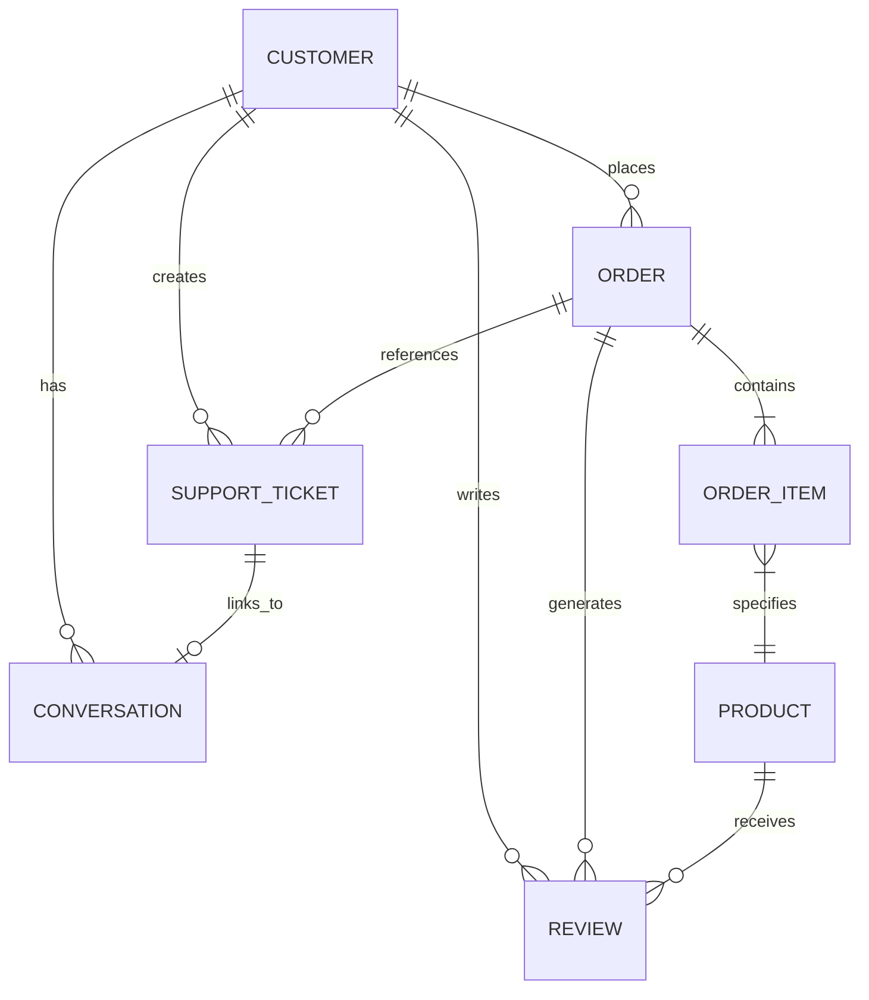

# NovaMart Database Schema & Entity Relational Graph
## Ground Truth Data Layer Specification

> **Source of Truth:** [`spec/Problem Statement(PS)/public-20261003T063850Z-1-001/public/`](file:///c:/Project/Hackathon/Hackathon_Boilerplate_speedrun/spec/Problem%20Statement(PS)/public-20261003T063850Z-1-001/public/)  
> **Designated Skills:** `spec-driven-development`, `api-and-interface-design`

---

## 1. Overview of the Ground Truth Data Layer

In NovaMart's operations, the structured database is the **sole source of truth**. Customer statements are treated as unverified claims. The data layer comprises 7 interconnected datasets totaling over 29,000 records, plus 14 detailed category specification sheets.



---

## 2. Relational Entity Schemas (Strict YAML Primacy)

### 2.1 Customers (`customers.csv`)
Total Records: 1,500  
Primary Key: `customer_id`  
Description: Customer profiles, contact details, account standing, loyalty tier, and lifetime spend.

```yaml
customers_table:
  table_name: "customers"
  primary_key: "customer_id"
  record_count: 1500
  columns:
    customer_id:
      type: "VARCHAR(16)"
      format: "CUST-XXXXX"
      nullable: false
      unique: true
      example: "CUST-00001"
    first_name:
      type: "VARCHAR(64)"
      nullable: false
      example: "Ravi"
    last_name:
      type: "VARCHAR(64)"
      nullable: false
      example: "Ali"
    email:
      type: "VARCHAR(128)"
      nullable: false
      example: "ravi.ali@webmail.example"
    phone:
      type: "VARCHAR(32)"
      format: "+91 XXXXX XXXXX"
      nullable: false
      example: "+91 80008 44305"
    gender:
      type: "VARCHAR(16)"
      enum: ["male", "female", "other"]
    date_of_birth:
      type: "DATE"
      format: "YYYY-MM-DD"
    city:
      type: "VARCHAR(64)"
      example: "Noida"
    state:
      type: "VARCHAR(64)"
      example: "Uttar Pradesh"
    pincode:
      type: "INTEGER"
      example: 201451
    address:
      type: "TEXT"
      example: "Flat 273, Celestial Apartments, 12th Main, Industrial Estate"
    customer_since:
      type: "DATE"
      format: "YYYY-MM-DD"
      example: "2019-01-21"
    customer_segment:
      type: "VARCHAR(32)"
      enum: ["regular", "frequent", "vip", "churn_risk"]
    account_status:
      type: "VARCHAR(16)"
      enum: ["active", "inactive", "suspended"]
      critical_note: "Orders or refunds for 'suspended' accounts MUST BE ESCALATED to Trust & Safety immediately."
    preferred_language:
      type: "VARCHAR(32)"
      enum: ["English", "Hinglish", "Hindi", "Bengali", "Telugu", "Tamil", "Marathi", "Gujarati"]
    total_orders:
      type: "INTEGER"
      example: 4
    total_spend:
      type: "NUMERIC(10,2)"
      example: 24778.00
    loyalty_tier:
      type: "VARCHAR(16)"
      enum: ["bronze", "silver", "gold", "platinum"]
      policy_impact:
        gold: "Grants +2 days extension to change-of-mind return windows."
        platinum: "Grants +3 days extension to change-of-mind return windows."
        bronze_silver: "No window extensions."
```

---

### 2.2 Orders (`orders.csv`)
Total Records: 8,000  
Primary Key: `order_id`  
Foreign Key: `customer_id` $\to$ `customers.customer_id`  
Description: Master order transactions, payment and shipping status, delivery verification, and financial totals.

```yaml
orders_table:
  table_name: "orders"
  primary_key: "order_id"
  foreign_keys:
    - customer_id: "customers.customer_id"
  record_count: 8000
  financial_formula: "total_amount = subtotal - discount + shipping_fee + tax"
  columns:
    order_id:
      type: "VARCHAR(16)"
      format: "ORD-XXXXXX"
      nullable: false
      example: "ORD-000001"
    customer_id:
      type: "VARCHAR(16)"
      nullable: false
      example: "CUST-00615"
    order_date:
      type: "TIMESTAMP"
      format: "YYYY-MM-DD HH:MM:SS"
      critical_note: "Determines applicable policy version: orders before 2026-06-01 follow v1; orders on/after 2026-06-01 follow v2."
    order_status:
      type: "VARCHAR(32)"
      enum:
        - "placed"              # Cancellable by agent
        - "confirmed"           # Cancellable by agent
        - "processing"          # Cancellable by agent
        - "shipped"             # In-transit; NOT cancellable
        - "out_for_delivery"    # Last mile; NOT cancellable
        - "delivered"           # Completed delivery; subject to return/refund windows
        - "cancelled"           # Cancelled before delivery
        - "returned"            # Fully returned
        - "partially_returned"  # Subset of items returned
    payment_method:
      type: "VARCHAR(32)"
      enum: ["upi", "credit_card", "debit_card", "net_banking", "wallet", "cash_on_delivery"]
    payment_status:
      type: "VARCHAR(32)"
      enum: ["paid", "pending", "failed", "refunded", "partially_refunded"]
    subtotal:
      type: "NUMERIC(10,2)"
    discount:
      type: "NUMERIC(10,2)"
    shipping_fee:
      type: "NUMERIC(10,2)"
      rule: "₹0 if subtotal after discount >= ₹1,000; otherwise flat ₹79."
    tax:
      type: "NUMERIC(10,2)"
      rule: "18% GST added at checkout."
    total_amount:
      type: "NUMERIC(10,2)"
      approval_threshold_rules:
        v1_policy: "If total_amount > ₹1,00,000, human approval is strictly mandatory."
        v2_policy: "If total_amount > ₹75,000, human approval is strictly mandatory."
    shipping_address:
      type: "TEXT"
    city:
      type: "VARCHAR(64)"
    state:
      type: "VARCHAR(64)"
    estimated_delivery_date:
      type: "DATE"
    actual_delivery_date:
      type: "DATE"
      critical_note: "Day 0 for return window and warranty calculations."
    tracking_number:
      type: "VARCHAR(32)"
      courier_prefixes: ["BAX", "SLN", "KVC", "DLP", "RRL"]
    courier:
      type: "VARCHAR(32)"
      enum: ["BlueArrow Express", "SwiftLane", "KaveriCargo", "DeltaPost", "RoadRunner Logistics"]
    delivery_status:
      type: "VARCHAR(32)"
      enum: ["not_dispatched", "in_transit", "out_for_delivery", "delivered", "lost"]
    delivery_otp_verified:
      type: "BOOLEAN"
      security_rule: "Mandatory for orders >= ₹5,000. If TRUE and customer claims non-delivery, DO NOT refund or replace. Escalate to Logistics Desk."
    cancellation_status:
      type: "VARCHAR(32)"
      enum: ["none", "approved", "auto_cancelled", "rejected"]
    refund_status:
      type: "VARCHAR(32)"
      enum: ["none", "pending", "processed", "partial", "rejected"]
```

---

### 2.3 Order Items (`order_items.csv`)
Total Records: 12,444  
Primary Key: `order_item_id`  
Foreign Keys: `order_id` $\to$ `orders.order_id`, `product_id` $\to$ `products.product_id`  
Description: Individual line items within an order, pricing, return statuses, and item-level refund amounts.

```yaml
order_items_table:
  table_name: "order_items"
  primary_key: "order_item_id"
  foreign_keys:
    - order_id: "orders.order_id"
    - product_id: "products.product_id"
  record_count: 12444
  columns:
    order_item_id:
      type: "VARCHAR(16)"
      format: "OI-XXXXXX"
      nullable: false
      example: "OI-000001"
    order_id:
      type: "VARCHAR(16)"
      nullable: false
      example: "ORD-000001"
    product_id:
      type: "VARCHAR(16)"
      nullable: false
      example: "PROD-00017"
    quantity:
      type: "INTEGER"
      default: 1
    unit_price:
      type: "NUMERIC(10,2)"
    discount:
      type: "NUMERIC(10,2)"
    final_price:
      type: "NUMERIC(10,2)"
      formula: "(unit_price * quantity) - discount"
    item_status:
      type: "VARCHAR(32)"
      enum: ["delivered", "shipped", "processing", "cancelled", "returned", "replaced"]
    return_status:
      type: "VARCHAR(32)"
      enum: ["none", "requested", "pickup_scheduled", "qc_pending", "qc_passed", "qc_failed", "completed"]
    refund_amount:
      type: "NUMERIC(10,2)"
      refund_rule: "item refund = (final_price * 1.18) - restocking_fee (if applicable under v2)"
```

---

### 2.4 Products (`products.csv`)
Total Records: 300  
Primary Key: `product_id`  
Unique Key: `sku`  
Description: Catalog of electronic products, brands, categories, warranty terms, and operational returnability flags.

```yaml
products_table:
  table_name: "products"
  primary_key: "product_id"
  unique_keys: ["sku"]
  record_count: 300
  columns:
    product_id:
      type: "VARCHAR(16)"
      format: "PROD-XXXXX"
      nullable: false
      example: "PROD-00001"
    sku:
      type: "VARCHAR(32)"
      example: "VOL-ACC-3744-CHA"
    product_name:
      type: "VARCHAR(128)"
      example: "Voltix 100W GaN Charger"
    category:
      type: "VARCHAR(32)"
      enum:
        - "Accessories"    # 34 items
        - "Smartphones"    # 30 items
        - "Earbuds"        # 24 items
        - "Laptops"        # 24 items (Restocking fee in v2: 5% max ₹2,500)
        - "Gaming"         # 22 items
        - "Headphones"     # 22 items
        - "Networking"     # 20 items
        - "Smartwatches"   # 20 items
        - "Speakers"       # 20 items
        - "Keyboards"      # 18 items
        - "Mice"           # 18 items
        - "Monitors"       # 18 items (Restocking fee in v2: 5% max ₹2,500)
        - "Tablets"        # 16 items (Restocking fee in v2: 5% max ₹2,500)
        - "Cameras"        # 14 items (Restocking fee in v2: 5% max ₹2,500)
    subcategory:
      type: "VARCHAR(64)"
      example: "Charger"
    brand:
      type: "VARCHAR(64)"
      example: "Voltix"
    description:
      type: "TEXT"
    price:
      type: "NUMERIC(10,2)"
    mrp:
      type: "NUMERIC(10,2)"
    discount_percent:
      type: "NUMERIC(5,2)"
    stock_quantity:
      type: "INTEGER"
    warranty_months:
      type: "INTEGER"
      range: "6 to 36 months"
      rule: "Warranty begins strictly on orders.actual_delivery_date."
    returnable:
      type: "BOOLEAN"
      rule: "If FALSE, change-of-mind returns are BLOCKED. Defective/damaged returns are still permitted within defect window."
    replacement_available:
      type: "BOOLEAN"
      rule: "If FALSE, defective items receive refund rather than replacement."
    rating:
      type: "NUMERIC(3,2)"
    review_count:
      type: "INTEGER"
    weight_kg:
      type: "NUMERIC(6,2)"
    color:
      type: "VARCHAR(32)"
    status:
      type: "VARCHAR(16)"
      enum: ["active", "discontinued", "out_of_stock"]
```

---

### 2.5 Reviews (`reviews.csv`)
Total Records: 3,000  
Primary Key: `review_id`  
Foreign Keys: `product_id` $\to$ `products.product_id`, `customer_id` $\to$ `customers.customer_id`, `order_id` $\to$ `orders.order_id`  
Description: Customer reviews, ratings, and feedback on purchased items.

```yaml
reviews_table:
  table_name: "reviews"
  primary_key: "review_id"
  foreign_keys:
    - product_id: "products.product_id"
    - customer_id: "customers.customer_id"
    - order_id: "orders.order_id"
  record_count: 3000
  columns:
    review_id:
      type: "VARCHAR(16)"
      format: "REV-XXXXXX"
    product_id:
      type: "VARCHAR(16)"
    customer_id:
      type: "VARCHAR(16)"
    order_id:
      type: "VARCHAR(16)"
    rating:
      type: "INTEGER"
      range: "1 to 5"
    title:
      type: "VARCHAR(128)"
    review_text:
      type: "TEXT"
    review_date:
      type: "DATE"
    verified_purchase:
      type: "BOOLEAN"
    helpful_votes:
      type: "INTEGER"
```

---

### 2.6 Support Tickets (`support_tickets.csv`)
Total Records: 2,500  
Primary Key: `ticket_id`  
Foreign Keys: `customer_id` $\to$ `customers.customer_id`, `order_id` $\to$ `orders.order_id` (nullable), `conversation_id` $\to$ `conversations.conversation_id` (nullable)  
Description: Previous support cases, escalation logs, and issue histories.

```yaml
support_tickets_table:
  table_name: "support_tickets"
  primary_key: "ticket_id"
  foreign_keys:
    - customer_id: "customers.customer_id"
    - order_id: "orders.order_id"
  record_count: 2500
  columns:
    ticket_id:
      type: "VARCHAR(16)"
      format: "TICK-XXXXX"
    customer_id:
      type: "VARCHAR(16)"
    order_id:
      type: "VARCHAR(16)"
      nullable: true
    created_at:
      type: "TIMESTAMP"
      format: "YYYY-MM-DD HH:MM:SS"
      critical_note: "If a customer raised a return/refund within the window and processing was delayed, this timestamp proves on-time filing."
    category:
      type: "VARCHAR(64)"
      enum:
        - "delivery"
        - "refund"
        - "return"
        - "order_tracking"
        - "cancellation"
        - "payment"
        - "damaged_product"
        - "technical"
        - "product_information"
        - "complaint"
        - "replacement"
        - "account"
        - "wrong_product"
        - "warranty"
        - "missing_product"
        - "fraud_suspicion"
    subcategory:
      type: "VARCHAR(64)"
    priority:
      type: "VARCHAR(16)"
      enum: ["low", "medium", "high", "critical"]
      sla:
        critical: "First response 15 min | Resolution 4 hours"
        high: "First response 1 hour | Resolution 24 hours"
        medium: "First response 4 hours | Resolution 3 business days"
        low: "First response 24 hours | Resolution 5 business days"
    status:
      type: "VARCHAR(32)"
      enum: ["open", "in_progress", "escalated", "resolved", "closed"]
    assigned_team:
      type: "VARCHAR(64)"
      enum:
        - "Tier 1 Support"
        - "Refunds & Payments"
        - "Logistics Desk"
        - "Technical Support"
        - "Trust & Safety"
        - "Customer Experience"
        - "Support Lead"
    issue_summary:
      type: "TEXT"
    resolution:
      type: "TEXT"
    created_by:
      type: "VARCHAR(32)"
      enum: ["customer", "agent", "system"]
    resolved_at:
      type: "TIMESTAMP"
      nullable: true
    conversation_id:
      type: "VARCHAR(32)"
      nullable: true
```

---

### 2.7 Conversations (`conversations.json`)
Total Records: 1,500 Multi-turn Chat Threads  
Primary Key: `conversation_id`  
Foreign Keys: `customer_id` $\to$ `customers.customer_id`, `order_id` $\to$ `orders.order_id` (nullable), `ticket_id` $\to$ `support_tickets.ticket_id` (nullable)  
Description: Historical customer service dialogues across chat, email, phone transcript, and WhatsApp.

```yaml
conversations_structure:
  record_count: 1500
  schema:
    conversation_id:
      type: "string"
      format: "CONV-XXXXXX"
      example: "CONV-000001"
    customer_id:
      type: "string"
      format: "CUST-XXXXX"
      example: "CUST-00055"
    order_id:
      type: "string | null"
      format: "ORD-XXXXXX"
    ticket_id:
      type: "string | null"
      format: "TICK-XXXXX"
    channel:
      type: "string"
      enum: ["chat", "whatsapp", "email", "phone_transcript"]
    language:
      type: "string"
      enum: ["English", "Hinglish", "Hindi", "Bengali", "Telugu", "Tamil", "Marathi", "Gujarati"]
    started_at:
      type: "string (ISO 8601 timestamp with offset)"
      example: "2026-01-02T06:18:30+05:30"
    status:
      type: "string"
      enum: ["resolved", "closed", "escalated", "open"]
    handled_by:
      type: "string"
      enum: ["bot", "human", "bot_then_human"]
    messages:
      type: "array of message_objects"
      items:
        role:
          type: "string"
          enum: ["customer", "agent"]
        timestamp:
          type: "string (ISO 8601 timestamp)"
        message:
          type: "string"
```

---

## 3. Operational Integrity Rules

1. **Foreign Key Integrity:** An order lookup must strictly match the authenticated `customer_id`. The agent must never release order details to a customer with a mismatched account ID.
2. **Delivery Date Day Zero:** All refund/return time windows count calendar days starting from `orders.actual_delivery_date` as Day 0.
3. **Repeated Claims Tracking:** Before acting on refunds or delivery disputes, query `support_tickets` for tickets with category `refund`, `return`, `delivery`, or `fraud_suspicion` in the preceding 90 days. If count $\ge 3$, escalate to Trust & Safety.
4. **Suspended Account Defense:** If `customers.account_status == 'suspended'`, refuse automated execution and escalate immediately to Trust & Safety.
