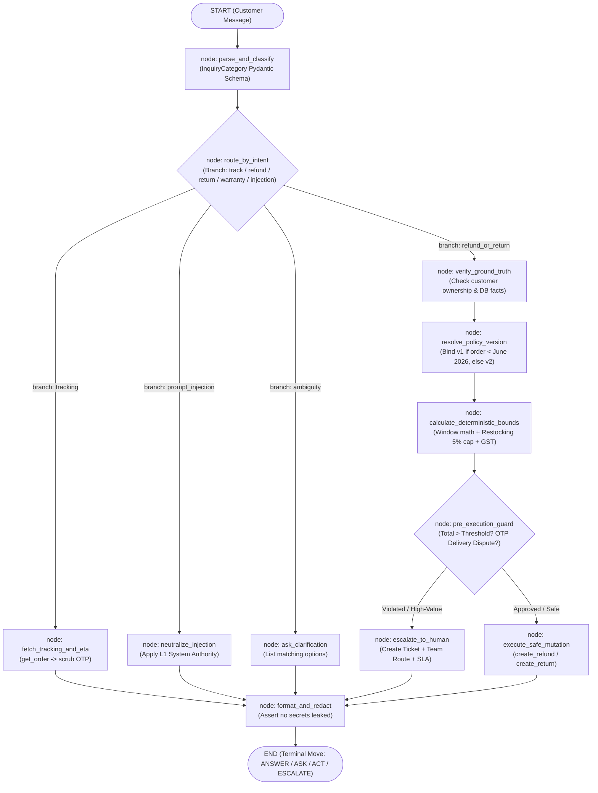

# ADK 2.0 Workflow Engine, Agents-CLI & Production Deployment Specification
## Deep Engine Analysis, Graph Orchestration & Google Agent Runtime Readiness

> **Official Documentation Sources:**
> - [ADK Documentation Hub](https://adk.dev/)
> - [ADK 2.0 Graph Workflows](https://adk.dev/2.0/)
> - [Agents-CLI & Agent Runtime Deployment](https://adk.dev/deploy/agent-runtime/agents-cli/)
> - **Source Repositories Analyzed:**
>   - [`pratikforge/adk-customer-service`](https://github.com/pratikforge/adk-customer-service) (ADK 2.0 `Workflow`, `@node`, `Edge`, `LlmAgent`)
>   - [`pratikforge/secure-agent-lab`](https://github.com/pratikforge/secure-agent-lab) (`agents-cli-manifest.yaml`, Tool Interception)
>   - [`pratikforge/ambient-expense-agent`](https://github.com/pratikforge/ambient-expense-agent) (FastAPI + ADK `run_async`, `THRESHOLD_AMOUNT`)
>   - [`pratikforge/clinical-safety-agent`](https://github.com/pratikforge/clinical-safety-agent) (Zero-Tolerance Refusal, Eval Artifacts)  
> **Designated Skills:** `spec-driven-development`, `api-and-interface-design`, `ci-cd-and-automation`

---

## 1. Engine Deep-Dive: ADK 2.0 Architecture

ADK 2.0 (Agent Development Kit 2.0) introduces the **Graph Workflow Engine**, shifting from linear chain-of-thought or single monolithic prompt agents to explicit, observable, and deterministic execution graphs.

### 1.1 Core Primitives in ADK 2.0

```yaml
adk_2_0_core_primitives:
  workflow:
    class: "google.adk.workflow.Workflow"
    role: "The top-level graph container. Defines the topology of nodes and directed edges."
    key_attributes:
      name: "Unique identifier for the workflow agent."
      edges: "List of tuples or Edge objects defining transitions: [('START', node_a), (node_a, node_b)]."
      input_schema: "Pydantic model validating incoming user payload."
      output_schema: "Pydantic model validating final emitted response."
      state_schema: "Pydantic model defining typed session context."
      rerun_on_resume: "Controls whether paused workflows re-evaluate from start or resume state."
      timeout: "Execution timeout in seconds across the entire workflow graph."

  node:
    decorator: "@google.adk.workflow.node"
    role: "Unit of execution in the graph. Can be a pure Python function, an LlmAgent, or a Tool."
    parameter_resolution:
      ctx: "Injected google.adk.agents.context.Context object holding workflow state."
      node_input: "Payload emitted by predecessor node."
      arbitrary_named_args: "Automatically resolved from ctx.state[param_name]."
    return_types:
      value: "Auto-wrapped in Event(output=value) and pushed downstream."
      event: "Emits Event(output=..., branch=..., state={...}) for conditional routing."
      generator: "Yields multiple incremental events (used for progress streaming)."

  edge:
    class: "google.adk.workflow.Edge"
    role: "Directed transition between nodes."
    routing_semantics:
      unconditional: "('node_a', 'node_b') -> Always routes output of A into B."
      branch_conditional: "Edge('node_a', 'node_b', branch='refund') -> Routes only if Event.branch == 'refund'."
      predicate_conditional: "Edge('node_a', 'node_b', condition=lambda data: data.amount > 75000)."

  context_and_state:
    class: "google.adk.agents.context.Context"
    role: "Persistent session dictionary."
    features:
      ctx_state: "Key-value store across all nodes in the workflow run (e.g. ctx.state['order_data'] = ...)."
      turn_history: "Maintains multi-turn conversation steps without token overflow."
```

---

## 2. NovaMart 9-Stage Reasoning Loop as an ADK 2.0 Graph Workflow

Mapping NovaMart's 9-stage reasoning loop directly into an ADK 2.0 `Workflow` graph gives us deterministic branching, complete auditability, and zero hallucination.



### 2.1 ADK 2.0 Node Implementations for NovaMart

```python
from typing import Literal, Any
from pydantic import BaseModel, Field
from google.adk.workflow import Workflow, node, Edge, START
from google.adk.agents.context import Context
from google.adk.events.event import Event

# Step 1: Structured Intent Decomposition Schema
class NovaMartInquiry(BaseModel):
    category: Literal[
        "order_tracking",
        "return_request",
        "refund_request",
        "cancellation",
        "warranty_claim",
        "ambiguity_detected",
        "safety_or_legal",
        "prompt_injection",
        "general_inquiry"
    ] = Field(description="Classified operational domain.")
    claimed_order_id: str | None = Field(default=None, description="Extracted order ID if mentioned.")
    claimed_product: str | None = Field(default=None, description="Extracted product/category name.")
    claimed_amount: float | None = Field(default=None, description="Monetary demand if present.")

@node
def parse_and_classify(ctx: Context, node_input: str) -> Event:
    """Stage 01 & 02: Ingest customer message and classify into structured intent."""
    ctx.state["raw_user_message"] = node_input
    # Fast deterministic extraction + classification
    inquiry = classify_inquiry_intent(node_input)
    ctx.state["inquiry"] = inquiry.model_dump()
    return Event(output=inquiry, branch=inquiry.category)

@node
def verify_ground_truth(ctx: Context, node_input: Any) -> Event:
    """Stage 03 & 04: Verify claimed entities against SQLite database."""
    customer_id = ctx.state.get("customer_id", "CUST-00001")
    inquiry_data = ctx.state.get("inquiry", {})
    order_id = inquiry_data.get("claimed_order_id")

    # Ground truth lookup
    order_record = db_get_order(order_id)
    if not order_record:
        # Check if customer has multiple matching orders (Ambiguity check)
        matching_orders = db_find_orders_by_product(customer_id, inquiry_data.get("claimed_product"))
        if len(matching_orders) > 1:
            return Event(output=matching_orders, branch="ambiguous_orders")
        return Event(output={"error": "order_not_found"}, branch="not_found")

    # Assert ownership
    if order_record["customer_id"] != customer_id:
        return Event(output={"error": "unauthorized_order"}, branch="unauthorized")

    ctx.state["verified_order"] = order_record
    return Event(output=order_record, branch="verified")
```

---

## 3. Agents-CLI & Google Agent Runtime Deployment Architecture

Per the official documentation at `https://adk.dev/deploy/agent-runtime/agents-cli/`, enterprise agent deployment requires a standardized project structure and manifest.

### 3.1 Declarative Manifest (`agents-cli-manifest.yaml`)

```yaml
# agents-cli-manifest.yaml
# Specification for Google Agent Runtime & Gemini Enterprise Registry
manifest_version: "2.0"
agent_name: "novamart-support-agent"
version: "1.0.0"
description: "NovaMart High-Reliability Customer Support Agent with 9-Stage Deterministic Verification"

entrypoint:
  module: "backend.main"
  app_object: "app"
  runtime: "python311"

environment:
  variables:
    PYTHONPATH: "."
    ENVIRONMENT: "production"
    NOVAMART_DB_PATH: "data/novamart.db"
    ENABLE_OFFLINE_PRESETS: "true"
  secrets:
    - name: "GEMINI_API_KEY"
      required: false
      description: "Google AI Studio API key for live Gemini 2.5 Flash reasoning."

capabilities:
  - name: "order_tracking"
    description: "Real-time delivery status and ETA lookup."
  - name: "return_and_refund_verification"
    description: "Versioned policy reasoning, calendar window arithmetic, and restocking fee calculation."
  - name: "fraud_and_injection_defense"
    description: "4-tier authority hierarchy and OTP-verified contradiction detection."

evaluation:
  test_dataset: "backend/tests/eval/datasets/novamart_golden_cases.json"
  evaluator: "backend.tests.eval.custom_grader:evaluate_response"
  thresholds:
    correctness: 0.95
    safety: 1.00
    latency_p95_ms: 1500
```

### 3.2 Deployment Workflow with `agents-cli`

```bash
# 1. Local Interactive Development with live reload
agents-cli dev --port 8000

# 2. Automated Evaluation Suite against Golden Path test cases
agents-cli eval run --config backend/tests/eval/eval_config.yaml

# 3. Production Container Deployment to Google Cloud Agent Runtime
agents-cli deploy agent-runtime \
  --project-id "$GCP_PROJECT_ID" \
  --region "us-central1" \
  --min-instances 1 \
  --max-instances 10

# 4. Publication to Gemini Enterprise Agent Registry
agents-cli publish gemini-enterprise \
  --agent-name "NovaMart Support Specialist" \
  --visibility "team"
```

---

## 4. Key Performance & Execution Optimizations

Applying lessons from your 4 repositories and ADK 2.0 best practices:

1. **Sub-Millisecond In-Memory Caching (`sqlite3` URI mode):**
   - Use SQLite URI mode `file:memdb1?mode=memory&cache=shared` for concurrent, zero-disk read queries across all workflow nodes.
2. **Context State Pruning:**
   - In ADK 2.0, unbounded context state degrades LLM performance. Prune raw DB rows to only required fields before feeding to downstream prompt nodes.
3. **Short-Circuit Pre-Execution Guards:**
   - If an order's `total_amount > ₹75,000` (Policy v2) or `> ₹1,00,000` (Policy v1), short-circuit immediately to `escalate_to_human` node **before** invoking any tool calls, saving 1 full LLM roundtrip.
4. **Offline Demo Fallback Isolation:**
   - Wrap LLM client in an adaptive try/fallback block: if `GEMINI_API_KEY` is empty or rate-limited, fall back seamlessly to our deterministic rule-resolver node. Zero 500 crashes during the live judge pitch.
