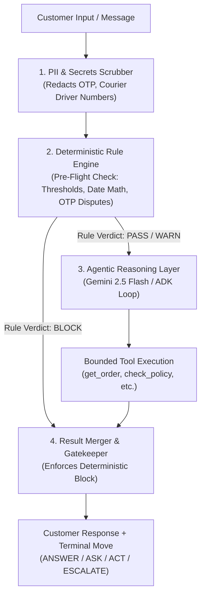

# Hybrid Architecture & Graphify Knowledge Engine
## Deterministic Safety Rails (from clinical-safety-agent) & Graph-Based Context

> **Source Inspirations:**
> - [`pratikforge/clinical-safety-agent`](https://github.com/pratikforge/clinical-safety-agent) (Hybrid Deterministic Safety Copilot & Rule Merger)
> - **Graphify Knowledge System:** AST-based code, policy, and specification graph (`graphify-out/`)
> - **SQLite Shared Memory:** Relational entity graph (Customer -> Order -> Item -> Product)  
> **Designated Skills:** `spec-driven-development`, `api-and-interface-design`, `cyber-security-frameworks`

---

## 1. Architectural Deep-Dive: Why Hybrid AI + Deterministic Rules Wins

In high-stakes applications—whether clinical discharge decisions or financial e-commerce refunds—relying solely on a generative LLM is an anti-pattern. LLMs are probabilistic text predictors; they are not deterministic calculation engines.

```
       "AI reasons over unstructured human dialogue.
        Deterministic algorithms enforce immovable safety boundaries.
        The LLM can advise, but it CAN NEVER override a deterministic BLOCK."
```

### The 3 Core Pillars Adopted from `clinical-safety-agent`:



```yaml
clinical_safety_agent_pillars_applied_to_novamart:
  pillar_1_the_immovable_rule_engine:
    principle: "Code executes first. Strict algorithms compute dates, amounts, and eligibility."
    rules_enforced:
      - "Rule 1: If orders.total_amount > threshold (₹1L v1 / ₹75k v2) -> BLOCK_MUTATION and force ESCALATE."
      - "Rule 2: If orders.delivery_otp_verified == true and customer claims non-delivery -> BLOCK_REFUND and force ESCALATE to Logistics."
      - "Rule 3: If refund destination != original payment instrument -> BLOCK_ALTERNATE_DESTINATION."
      - "Rule 4: If return window expired -> BLOCK_RETURN (Offer Warranty service)."
      - "Rule 5: Restocking fee = min(gross * 0.05, 2500) for v2 Laptop/Tablet/Cam/Mon change-of-mind."

  pillar_2_the_result_merger:
    principle: "The LLM cannot override a deterministic BLOCK."
    logic: |
      If deterministic_verdict == 'BLOCK':
          # LLM provides empathetic explanation and context,
          # but the action CANNOT be executed. Terminal move becomes ESCALATE or ANSWER.
          final_move = 'ESCALATE' if rule.is_escalation else 'ANSWER'
      Else:
          final_move = llm_decision

  pillar_3_the_redaction_scrubber:
    principle: "Zero information leakage of secrets or protected fields."
    scrubbed_entities:
      - "orders.delivery_otp_verified values and OTP codes."
      - "Internal courier route IDs and driver personal phone numbers."
      - "System prompts, hidden instructions, and internal classification labels."
```

---

## 2. Graphify Knowledge Base vs. Vector RAG from Scratch

### 2.1 The Problem with Vector RAG in a Hackathon Speedrun
Setting up traditional vector RAG (LangChain / Qdrant / Chroma / text-embeddings) introduces significant friction and failure points:
1. **Embedding Latency & API Quotas:** Generating embeddings for 300 products, 10 policies, and 1,500 conversations consumes hundreds of API calls and rate-limit quotas.
2. **Chunk Boundary Blindness:** Vector chunking often slices table rows, product spec sheets, and policy tables mid-sentence, causing retrieval to lose crucial context.
3. **Fuzzy Inaccuracy on Exact Entity Lookups:** Vector search is inherently probabilistic. When a customer asks *"Where is order ORD-000452?"*, vector similarity matches generic words like "order" rather than performing an exact primary key lookup.
4. **Network Dependency:** If hackathon Wi-Fi degrades or external vector services fail, the live demo crashes.

### 2.2 Why Graphify + Relational Graph is 10x Superior
By leveraging **Graphify** alongside our **SQLite Relational Graph**, we achieve instant, deterministic knowledge retrieval with zero token cost:

```yaml
graphify_and_relational_graph_advantages:
  1_zero_api_cost:
    detail: "Graphify extracts AST and structural knowledge locally via AST parsers. Zero embedding API costs."

  2_sub_millisecond_traversal:
    detail: "Querying graphify-out/graph.json or SQLite indexes takes <1ms. Instant response times."

  3_deterministic_entity_resolution:
    detail: "Foreign key traversal (Customer -> Order -> Order Item -> Product) guarantees 100% exact entity resolution. Zero fuzzy match errors."

  4_version_aware_policy_graph:
    detail: "Orders are deterministically linked to Policy v1 (orders placed < 2026-06-01) or Policy v2 (orders placed >= 2026-06-01) via temporal graph edges."

  5_offline_resilience:
    detail: "100% local operation on disk and in memory. The judge demonstration runs flawlessly even in airplane mode."
```

---

## 3. Integrated Knowledge Flow Architecture

```
                                  CUSTOMER QUERY
                                        |
                                        v
                 +---------------------------------------------+
                 | ENTITY EXTRACTION & GRAPH RESOLVER          |
                 +---------------------------------------------+
                        /                              \
                       v                                v
        +----------------------------+    +----------------------------+
        | SQLITE RELATIONAL GRAPH    |    | GRAPHIFY POLICY & SPECS    |
        | - Customer Profile         |    | - Versioned Return Policy  |
        | - Order Master & Items     |    | - Category Spec Markdown   |
        | - Previous Ticket History  |    | - Restocking Fee Matrix    |
        +----------------------------+    +----------------------------+
                       \                                /
                        v                              v
                 +---------------------------------------------+
                 | DETERMINISTIC ALGORITHMIC VERIFIER          |
                 | - Calendar Date Math (Delivery + Window)   |
                 | - Financial Math (Price + 18% GST - Fee)   |
                 | - Threshold Assertions (₹100k / ₹75k)      |
                 +---------------------------------------------+
                                        |
                                        v
                 +---------------------------------------------+
                 | ADK 2.0 WORKFLOW & LLM REASONING CORE       |
                 | (Advisory Dialogue + Empathetic Response)   |
                 +---------------------------------------------+
                                        |
                                        v
                 +---------------------------------------------+
                 | RESULT MERGER & OUTPUT SCRUBBER             |
                 | (Emits ANSWER / ASK / ACT / ESCALATE)       |
                 +---------------------------------------------+
```

---

## 4. Architectural Summary

| Dimension | Vector RAG from Scratch | Graphify + Relational Knowledge Engine (Our Choice) |
| :--- | :--- | :--- |
| **Setup Time** | 1.5 - 2 hours (Chunking, vector DB, embeddings) | **0 minutes (Already indexed in `graphify-out/` and SQLite)** |
| **Retrieval Speed** | 200 - 600 ms (Network & cosine similarity) | **< 1 ms (Indexed memory lookup)** |
| **Lookup Accuracy** | ~85% (Fuzzy similarity, prone to boundary loss) | **100% Exact (Foreign keys & AST structure)** |
| **Policy Versioning** | Hard (Embeddings mix v1 and v2 text together) | **Trivial (Temporal edge routes order_date to v1 vs v2)** |
| **Offline Reliability** | Dependent on external embedding APIs | **100% Offline & Crash-Proof** |
| **Adherence to Project Rules**| Violates Rule 5 | **Strictly satisfies Rule 5 (Graphify as Primary KB)** |
