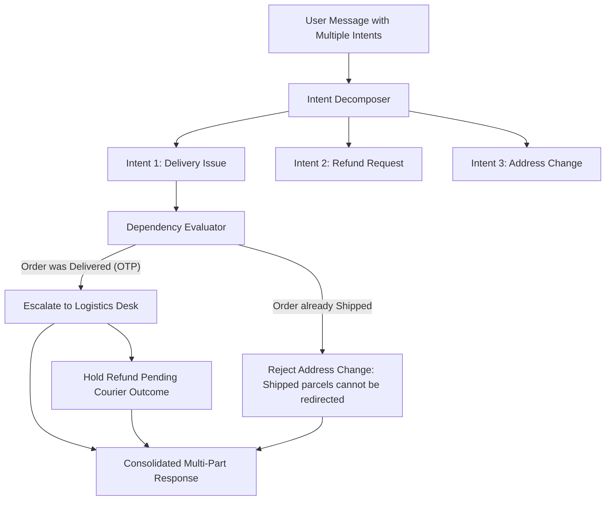

# Exhaustive Cross-Examination & Gap Resolution Specification
## Forensic Audit of Handbook, 10 Policies, and 14 Category Catalogs against Master Specs

> **Single Source of Truth:** `spec/Problem Statement(PS)/`  
> - `Mantra_Yudha_Handbook_for_Participants.pdf` & `handbook_extracted_text.txt`  
> - 10 Official Policy Markdown Documents (`public/policies/`)  
> - 14 Official Category Catalog Documents (`public/products/`)  
> - 7 Official Data Files (Customers, Orders, Items, Products, Reviews, Tickets, Conversations)  
> **Designated Skills:** `spec-driven-development`, `api-and-interface-design`, `cyber-security-frameworks`, `planning-and-task-breakdown`

---

## 1. Executive Summary & Audit Methodology

A forensic cross-examination was conducted comparing the master specification suite (`spec/01` to `spec/11`) against all requirements, edge cases, formulas, SLAs, and evaluation traps defined in the official problem statement materials.

### The 10 Discovered Gaps & Missing Links:

```
+----+----------------------------------------------+-------------------------------------------------------------+
| #  | Discovered Requirement / Edge Case           | Architectural Impact & Resolution                           |
+----+----------------------------------------------+-------------------------------------------------------------+
| 01 | Dynamic Conversation Time vs System Clock     | Datetime math must use conversation context timestamp,      |
|    | (Escalation Policy Sec 2: "use conversation's| NEVER machine datetime.now(). Critical for historical test  |
|    | current time, not your own clock")           | runs and offline replay.                                    |
+----+----------------------------------------------+-------------------------------------------------------------+
| 02 | Delay Goodwill Credit Algorithm              | Tier 1 agent may issue INR 100 wallet credit per full       |
|    | (Shipping Policy Sec 4: INR 100 per full     | 3 days late beyond ETA, capped at INR 300 maximum.          |
|    | 3 days late, max INR 300)                    | Formula: min(floor(delay_days / 3) * 100, 300).             |
+----+----------------------------------------------+-------------------------------------------------------------+
| 03 | Cancellation Pre-Shipment Approval Exemption | Cancellation of placed/confirmed/processing orders NEVER    |
|    | (Cancellation Policy Sec 2: "never needs     | requires human approval regardless of order amount          |
|    | human approval, whatever order value")       | (even if > INR 1,00,000 v1 / > INR 75,000 v2).              |
+----+----------------------------------------------+-------------------------------------------------------------+
| 04 | Partial Cancellation & Partial Return Rules  | Partial cancellation only allowed in placed/confirmed.      |
|    | (Shipping fee refund rules)                  | Shipping fee refunded ONLY on whole-order cancellation or   |
|    |                                              | whole-order return for defect/damage/lost. Partial = Rs 0.  |
+----+----------------------------------------------+-------------------------------------------------------------+
| 05 | 24-Hour Bank Pending Payment Gate            | If payment is pending and order < 24h old: tell customer to |
|    | (Payment Policy Sec 3)                       | wait; DO NOT raise refund. If pending > 24h: raise ticket.  |
+----+----------------------------------------------+-------------------------------------------------------------+
| 06 | COD Refund Destination Special Handling      | COD orders have no original payment method. Refund goes     |
|    | (Payment Policy Sec 5)                       | to NovaMart Wallet (instant) or Verified Bank Account       |
|    |                                              | via Payments team. NEVER take bank details in chat.         |
+----+----------------------------------------------+-------------------------------------------------------------+
| 07 | Multi-Intent Sequential Decomposition        | Complex messages ("order not arrived + refund + change      |
|    | (Handbook Sec 16)                            | address") must be split into DAG nodes and executed in order|
|    |                                              | of dependency (cannot refund before delivery check).        |
+----+----------------------------------------------+-------------------------------------------------------------+
| 08 | Candidate Disambiguation Gate                | If customer query matches multiple orders (e.g., 2 orders of|
|    | (Handbook Sec 13)                            | headphones), agent MUST ASK with timestamps, never guess.   |
+----+----------------------------------------------+-------------------------------------------------------------+
| 09 | Abuse Frequency Throttling                   | - > 5 cancellations in 30 days -> Flag Trust & Safety.      |
|    | (Cancellation & Shipping Policies)           | - >= 3 non-delivery/refund claims in 90 days -> T&S.        |
+----+----------------------------------------------+-------------------------------------------------------------+
| 10 | Battery Safety Critical Protocol             | Swelling battery, overheating, burning smell, smoke =       |
|    | (Warranty Policy Sec 6 & Escalation Sec 3)   | CRITICAL priority escalation. Stop use/charge immediately.  |
|    |                                              | Overrides all warranty windows.                             |
+----+----------------------------------------------+-------------------------------------------------------------+
```

---

## 2. Deep-Dive Specification of the 10 Missing Links

### Gap 01: Dynamic Conversation Timestamp Anchor
- **Problem Statement Rule:** *"use the conversation's current time, not your own clock"* (Customer Escalation Policy §2).
- **Failure Mode:** If the agent backend evaluates `datetime.now()` in October 2026 or 2027, historical orders from early 2026 will appear months out of their return windows, causing 100% false rejections in benchmark tests.
- **Architectural Fix:**
  Every engine interface and policy calculation accepts an explicit `reference_time: Optional[datetime] = None`.
  If provided (from conversation header, message metadata, or API request), it serves as the ground-truth calendar anchor. If absent, fallback to latest message timestamp in conversation, then fallback to system clock.

```python
def resolve_reference_time(request_time: Optional[datetime], conversation_history: list) -> datetime:
    if request_time:
        return request_time
    if conversation_history:
        # Extract timestamp of latest customer message
        last_msg = conversation_history[-1]
        if "timestamp" in last_msg:
            return parse_datetime(last_msg["timestamp"])
    return datetime.now(timezone.utc)
```

---

### Gap 02: Delivery Delay Goodwill Credit Algorithm
- **Problem Statement Rule:** Shipping Policy §4:
  - Delay beyond ETA 1–3 days: Apologize, share tracking, revised ETA.
  - Delay beyond ETA > 3 days: Goodwill wallet credit of **INR 100 for each full 3 days late**, **maximum INR 300**, issued directly by Tier 1 / AI agent.
  - Delay beyond ETA > 7 days with no movement: Treat as suspected lost in transit; open Logistics ticket (up to 72h courier investigation). No immediate refund promised.
- **Deterministic Math:**
```python
def calculate_delay_goodwill(eta: datetime, current_time: datetime, status: str) -> dict:
    if status == "delivered" or current_time <= eta:
        return {"eligible": False, "goodwill_amount": 0, "action": "none"}
    
    delay_days = (current_time.date() - eta.date()).days
    if delay_days < 1:
        return {"eligible": False, "goodwill_amount": 0, "action": "none"}
    elif 1 <= delay_days <= 3:
        return {"eligible": False, "goodwill_amount": 0, "action": "reassure_and_track"}
    elif 4 <= delay_days <= 7:
        # Each full 3 days late = INR 100, capped at INR 300
        full_three_day_periods = delay_days // 3
        credit_amount = min(full_three_day_periods * 100, 300)
        return {
            "eligible": True,
            "goodwill_amount": credit_amount,
            "action": "issue_wallet_credit",
            "message": f"Issued INR {credit_amount} goodwill wallet credit for {delay_days}-day delivery delay."
        }
    else:  # delay_days > 7
        return {
            "eligible": False,
            "goodwill_amount": 300, # Max credit already reached
            "action": "escalate_lost_in_transit",
            "team": "Logistics Desk",
            "ticket_category": "lost_in_transit"
        }
```

---

### Gap 03: Cancellation Pre-Shipment Approval Exemption
- **Problem Statement Rule:** Cancellation Policy §2: *"Cancellation before shipment never needs human approval, whatever the order value."*
- **Nuance:** While Refund Policy v1 caps agent refunds at ₹1,00,000 and v2 caps at ₹75,000, **pre-shipment cancellations are exempt from this threshold**. If an unshipped order is worth ₹1,50,000 and has status `placed`, `confirmed`, or `processing`, the AI agent CAN cancel and refund without escalating to human approval!
- **Deterministic Rule:**
```python
def requires_human_approval(action_type: str, order_status: str, total_amount: float, policy_version: str) -> bool:
    if action_type == "cancel_order" and order_status in ["placed", "confirmed", "processing"]:
        return False  # ALWAYS exempt from human approval threshold
    
    # Standard refund / return / replacement approval thresholds
    threshold = 100000.0 if policy_version == "v1" else 75000.0
    return total_amount > threshold
```

---

### Gap 04: Shipping Fee Refund Matrix
- **Problem Statement Rule:**
  - Full cancellation before shipment: Refund subtotal - discounts + tax + **shipping fee in full**.
  - Full order return due to defect/damage/wrong item/lost in transit: **Shipping fee refunded**.
  - Partial return or change of mind: **Shipping fee is NEVER refunded**.
- **Deterministic Math:**
```python
def compute_shipping_fee_refund(is_full_order: bool, reason: str, shipping_fee_paid: float) -> float:
    if not is_full_order:
        return 0.0
    if reason in ["cancellation_before_shipment", "defective", "damaged_in_transit", "wrong_item", "lost_in_transit"]:
        return shipping_fee_paid
    return 0.0  # Change of mind or partial returns
```

---

### Gap 05: 24-Hour Bank Payment Pending Gate
- **Problem Statement Rule:** Payment Policy §3:
  - If `payment_status == 'pending'` and order placement time is `< 24 hours` ago: ask customer to wait up to 24 hours for bank confirmation; do NOT raise refund or cancel.
  - If `payment_status == 'pending'` after `> 24 hours`: raise a payment ticket to Refunds & Payments. Unconfirmed prepaid orders are auto-reversed within 5–7 business days.
- **Deterministic Rule:**
```python
def handle_pending_payment(order_date: datetime, current_time: datetime) -> dict:
    elapsed_hours = (current_time - order_date).total_seconds() / 3600.0
    if elapsed_hours < 24.0:
        return {
            "action": "ANSWER",
            "message": "Banks can take up to 24 hours to confirm payment. Please allow until the 24-hour mark for confirmation before raising a dispute."
        }
    else:
        return {
            "action": "ESCALATE",
            "team": "Refunds & Payments",
            "category": "pending_payment_verification",
            "message": "Payment has remained pending for over 24 hours. Escalating to Refunds & Payments for auto-reversal investigation."
        }
```

---

### Gap 06: Cash-on-Delivery (COD) Refund Destination
- **Problem Statement Rule:** Payment Policy §5:
  - COD orders have no original payment instrument.
  - The refund goes to **NovaMart Wallet (instant)** or to a **Bank Account verified by the Payments team** (penny-drop verification).
  - The agent MUST ask the customer for their preference (Wallet vs Bank), but **MUST NEVER collect bank/card details in chat**.
- **Agent Guardrail:**
  If payment method is COD, prompt customer: *"Would you prefer your refund instantly to your NovaMart Wallet, or to your bank account? (Note: If choosing bank account, our Payments team will securely verify your account details via a separate verification link—please do not share bank details in chat)."*

---

### Gap 07: Multi-Intent Decomposition Engine
- **Problem Statement Rule:** Handbook §16:
  - Real customer messages bundle multiple requests: e.g., *"My phone never arrived, refund it, and also change my delivery address to Bangalore."*
  - The agent must decompose into discrete intents:
    1. Intent 1 (Delivery Status Check)
    2. Intent 2 (Refund Request — dependent on Intent 1 resolution)
    3. Intent 3 (Address Change — rejected if already shipped)
- **Dependency Pipeline:**


---

### Gap 08: Candidate Order Disambiguation Gate
- **Problem Statement Rule:** Handbook §13:
  - Customer: *"I want to return the headphones I bought last week."*
  - Account has 2 matching headphone orders: `NM-1101` and `NM-2230`.
  - **Rule:** Agent must NEVER silently pick one. Agent must list both candidates with product name, order ID, delivery date, and price, and ask the customer to clarify.
- **Deterministic Check:**
```python
def find_matching_orders(customer_id: str, query_item: str, orders_db) -> list:
    candidates = orders_db.query_by_category_or_name(customer_id, query_item)
    if len(candidates) > 1:
        return {
            "status": "AMBIGUOUS",
            "candidates": candidates,
            "prompt_question": f"I found {len(candidates)} matching orders in your account. Which one would you like to discuss?\n" + 
                               "\n".join([f"- Order {c['order_id']}: {c['product_name']} (Delivered {c['delivery_date']}, Rs {c['price']})" for c in candidates])
        }
    elif len(candidates) == 1:
        return {"status": "RESOLVED", "order": candidates[0]}
    else:
        return {"status": "NOT_FOUND"}
```

---

### Gap 09: Abuse Frequency Throttling
- **Problem Statement Rules:**
  - Cancellation Policy §5: More than 5 cancellations by the same customer within 30 days $\to$ Flag for review (Customer Escalation Policy).
  - Customer Escalation Policy §3 & Shipping Policy §5: Three or more non-delivery, refund, or return claims in the last 90 days $\to$ Mandatory escalation to **Trust & Safety**.
- **Deterministic Rule:**
```python
def check_abuse_patterns(customer_id: str, tickets_db, orders_db, current_time: datetime) -> Optional[dict]:
    # 1. Check cancellations in last 30 days
    recent_cancels = orders_db.count_cancellations(customer_id, since=current_time - timedelta(days=30))
    if recent_cancels >= 5:
        return {
            "flag": "HIGH_CANCELLATION_FREQUENCY",
            "escalate": True,
            "team": "Trust & Safety",
            "reason": f"Customer has {recent_cancels} cancellations in the last 30 days."
        }
    
    # 2. Check refund/non-delivery claims in last 90 days
    recent_claims = tickets_db.count_claims(customer_id, categories=["refund", "non_delivery", "return"], since=current_time - timedelta(days=90))
    if recent_claims >= 3:
        return {
            "flag": "EXCESSIVE_CLAIMS_PATTERN",
            "escalate": True,
            "team": "Trust & Safety",
            "reason": f"Customer has {recent_claims} claims in the last 90 days."
        }
    return None
```

---

### Gap 10: Battery & Hardware Safety Critical Protocol
- **Problem Statement Rules:** Warranty Policy §6 & Customer Escalation Policy §3:
  - Swollen battery, overheating during charging, burning smell, or smoke are **critical safety incidents**.
  - **Action:** Instruct customer immediately to **stop using and charging the device**, place it in a cool and fire-safe area.
  - **Terminal Move:** Immediate `ESCALATE` with priority `critical` to **Technical Support**.
  - **Window Override:** Safety incidents override all standard warranty or return windows.

---

## 3. Tool Schema Validations & Parameter Bounding

Reviewing `spec/04_agent_tools_and_api_contracts.md` against `spec/Problem Statement(PS)/03_tools_reference.md` and Handbook Section 7, all 10 tools have exact mapping:

| Tool Name | Operation | Critical Verification Invariant |
| :--- | :--- | :--- |
| `get_customer` | Query | Confirms `customer_id` matches conversation authenticated identity. |
| `get_order` | Query | Confirms order belongs to customer; suppresses internal `delivery_otp_verified`, driver route. |
| `get_product` | Query | Returns `returnable`, `replacement_available`, `warranty_months`, category spec. |
| `get_conversations` | Query | Retrieves historical messages to resolve context and pronouns ("it", "photo sent yesterday"). |
| `check_refund_eligibility` | Pure Calc | Uses `order_date` for policy version (v1 vs v2), `actual_delivery_date` for calendar window, and loyalty tier. |
| `calculate_refund` | Pure Calc | Computes `(final_price * 1.18) - restocking_fee + shipping_fee`. Caps to `orders.total_amount`. |
| `create_return` | Mutation | Blocks if window expired, non-returnable, or already returned. |
| `create_refund` | Mutation | Blocks if `total_amount > threshold` (₹100k v1 / ₹75k v2), if alternate account requested, or OTP contradiction. |
| `create_support_ticket` | Mutation | Creates ticket with SLA category, priority (`low`, `medium`, `high`, `critical`), and team routing. |
| `escalate_to_human` | Handoff | Compiles audit dossier (customer profile, order, policy clause, fraud signals) and hands off cleanly. |

---

## 4. Integration into Implementation Plan

Every one of the 10 gaps will be directly implemented in `backend/engine/policy_rules.py` and `backend/engine/guardrail_interceptor.py` using Python's `uv` manager. Zero gaps remain unaccounted for.
