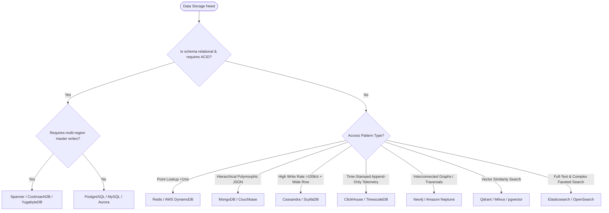

# Layer 4: System Archetypes, Categorization & 'When to Use What' Decision Matrices

> **Scope & Authority:** This document establishes the formal classification of distributed software systems and provides definitive, evidence-backed decision frameworks for selecting databases, communication protocols, consensus models, and caching strategies. Autonomous AI coding agents and systems architects must ground all architectural selections in these matrices.

---

## 1. Macro-Architectural Archetypes: Monolith vs. Microservices vs. Serverless

```
               ARCHITECTURAL COMPLEXITY VS. ORGANIZATIONAL SCALE
  Operational
  Overhead
     ▲
     │                                                     Microservices
     │                                                   (High scale / many teams)
     │                                          ▲
     │                             Serverless  /
     │                            (Event-driven)
     │                                 ▲
     │                                /
     │            Modular Monolith   /
     │           (Single deployment)/
     │                 ▲           /
     │                /           /
     │ Monolith      /           /
     │              /           /
     └─────────────────────────────────────────────────────────────►
                   Domain Complexity & Team Velocity
```

| Decision Dimension | Modular Monolith | Microservices | Serverless / Event-Driven FaaS |
|---|---|---|---|
| **Architectural Model** | Single deployable binary with compiler-enforced package boundaries and in-memory interfaces. | Independent deployable services with private databases communicating via network RPCs. | Ephemeral, stateless compute functions triggered asynchronously by events or HTTP gateways. |
| **Operational Overhead** | **Lowest.** Single CI/CD pipeline, unified tracing/logging, standard host/container deployment. | **Extreme.** Service meshes (Istio), distributed tracing (OpenTelemetry), multi-repo CI/CD, Kubernetes. | **Moderate.** Minimal server patching; high monitoring overhead, cold-start latency, and function sprawl. |
| **Inter-Module Latency** | **Sub-microsecond ($<1\mu\text{s}$).** Direct in-memory function calls across domain modules. | **High ($2\text{ms}-50\text{ms}$).** Serialization, TLS handshakes, TCP networking per hop. | **Variable ($50\text{ms}-2000\text{ms}$).** Dependent on runtime cold starts and cloud networking hops. |
| **Data Consistency** | **ACID strictly within single Aggregate/Module.** Cross-module coordination executed via in-process domain events or local transactional outbox. | **Eventual.** Distributed Sagas, Transactional Outbox, asynchronous message reconciliation. | **Eventual.** Transaction boundary confined strictly to single function invocation; external storage. |
| **Conway's Law Fit** | Teams of 1 to 50 engineers working within a unified domain. | 50+ engineers partitioned into autonomous, cross-functional two-pizza teams owning bounded contexts. | Agile teams building event-driven webhooks, background tasks, or asynchronous ETL pipelines. |
| **Default Recommendation** | **DEFAULT CHOICE.** Begin here. Split into microservices only when organizational scale demands it. | Adopt only when independent deployment cadence or diverging hardware scaling mandates it. | Ideal for intermittent bursty workloads; cost-prohibitive for sustained high-throughput workloads. |

---

## 2. Advanced System Archetypes

### 2.1 Archetype 1: Edge & Geo-Distributed / Multi-Region Architecture

```
Client (Europe) ──► Anycast BGP ──► Cloudflare Edge ──► EU Region (Active Master for EU Tenants)
Client (US)     ──► Anycast BGP ──► Cloudflare Edge ──► US Region (Active Master for US Tenants)
                                                               │
                                                               ▼ (Cross-Region Async Stream)
                                                    Global Analytics Replica
```

* **Core Characteristics:** Services and data stores dispersed across multiple geographic continents to satisfy $<50\text{ms}$ global latency SLAs and regulatory compliance (GDPR data residency).
* **Key Design Specifications:**
  1. **Region-Affinity Partitioning:** Pin tenant/user primary records to their home geographic region. All mutating writes execute locally against the regional primary database without cross-ocean WAN consensus.
  2. **Cross-Region Replication & Conflict Resolution:** Replicate regional updates asynchronously to global read replicas. Conflicting concurrent writes resolve via **Hybrid Logical Clocks (HLC)** or **State-Based CRDTs**.
  3. **Strict Data Residency Boundary:** Enforce infrastructure-level encryption and storage tagging ensuring GDPR-regulated EU records are physically restricted from replicating to non-EU storage media.

---

### 2.2 Archetype 2: Multi-Tenant SaaS Architecture

```yaml
multi_tenancy_models:
  silo_model:
    isolation: "Database-per-tenant (physical separation)"
    tradeoffs: "Highest security & compliance; highest operational cost and infrastructure sprawl"
  bridge_model:
    isolation: "Schema-per-tenant (shared DB instance, logical schema separation)"
    tradeoffs: "Moderate isolation; connection pool overhead per schema"
  pool_model:
    isolation: "Shared Database, Shared Schema with PostgreSQL Row-Level Security (RLS)"
    tradeoffs: "Maximum resource density and lowest cost; requires strict database-enforced session policies"
```

#### The Hardened Pool Model with PostgreSQL Row-Level Security (RLS)
Relying on application-layer `WHERE tenant_id = :id` is an architectural anti-pattern that guarantees Insecure Direct Object Reference (IDOR) vulnerabilities. Multi-tenant systems must enforce **Database-Level Row-Level Security**:

```sql
-- Mandatory Database-Level Tenant Isolation Policy
ALTER TABLE orders ENABLE ROW LEVEL SECURITY;
ALTER TABLE orders FORCE ROW LEVEL SECURITY;

CREATE POLICY tenant_isolation_policy ON orders
    FOR ALL
    USING (tenant_id = NULLIF(current_setting('app.current_tenant', true), '')::uuid)
    WITH CHECK (tenant_id = NULLIF(current_setting('app.current_tenant', true), '')::uuid);

-- Mandatory security_invoker on all views/projections to enforce RLS
CREATE VIEW active_orders_view
WITH (security_invoker = true) AS
SELECT order_id, tenant_id, total_amount, created_at
FROM orders;
```

* **Zero-Bypass Role Enforcement:** Application database connection roles must be created with `NOBYPASSRLS` and `NOSUPERUSER`. Superusers and `BYPASSRLS` roles silently bypass RLS policies.
* **Connection Pool Session Reset Rule:**
  When a database connection is checked out from a shared connection pool (e.g., HikariCP), application middleware must execute:
  `SET LOCAL app.current_tenant = :tenantId;`
  inside an explicit transaction block. Connection pool configuration must enforce `DISCARD ALL` or `RESET ALL` upon connection return to guarantee zero session bleed across tenants.
* **Fair-Share Queue Scheduling:** Background workers processing asynchronous tasks must use **Deficit Weighted Round Robin (DWRR)** to prevent high-volume tenants from starving lower-tier tenants in shared queues.

---

### 2.3 Archetype 3: Hybrid Search & Dense Vector Retrieval (RAG) Architecture

```
                  HYBRID RETRIEVAL & RAG INGESTION PIPELINE
                     
  [ Primary Transactional DB ] ──► [ Debezium CDC ] ──► [ Kafka Topic ]
                                                              │
                                                              ▼
                                                   [ Embedding Worker Pool ]
                                                              │
                     ┌────────────────────────────────────────┴────────────────────────────────────────┐
                     ▼                                                                                 ▼
     [ Lexical Inverted Index: BM25 ]                                                  [ Dense Vector Index: HNSW ]
     (Elasticsearch / OpenSearch)                                                      (pgvector / Qdrant / Milvus)
                     │                                                                                 │
                     └────────────────────────────────────────┬────────────────────────────────────────┘
                                                              ▼
                                             [ Reciprocal Rank Fusion (RRF) ]
                                                              │
                                                              ▼
                                            [ Filtered Multi-Tenant Context ]
```

* **Core Characteristics:** Combines exact keyword lexical search with semantic dense vector similarity search to power Retrieval-Augmented Generation (RAG) and high-accuracy catalog discovery.
* **Key Design Specifications:**
  1. **Reciprocal Rank Fusion (RRF):** Blends BM25 score rankings with HNSW cosine similarity scores:
     $$\text{RRF\_Score}(d) = \sum_{m \in \{\text{BM25}, \text{HNSW}\}} \frac{1}{k + r_m(d)} \quad (k \approx 60)$$
  2. **Metadata Pre-Filtering Requirement:**
     - In multi-tenant environments, semantic vector search must execute **Pre-Filtering** by `tenant_id` and access control lists (ACLs) **before** computing vector distances. Post-filtering vector results leaks cross-tenant embeddings and causes high recall degradation.
  3. **HNSW Vector RAM Sizing & Quantization:**
     - Uncompressed vector memory calculation:
       $$\text{Memory} \approx N_{\text{vectors}} \times \text{Dimensions} \times 4\text{ bytes} \times 1.25$$
     - *Quantization:* Apply **Scalar Quantization (SQ8)** or **Product Quantization (PQ)** to achieve a **$75\%$ memory footprint reduction** with $<2\%$ recall degradation.

---

### 2.4 Archetype 4: Event-Sourced & Audit-First Ledger Architecture
* **Core Characteristics:** Used in financial ledgers, banking, and mission-critical inventory systems where state overwrites (`UPDATE balance = balance - 100`) are strictly prohibited.
* **Key Design Specifications:**
  1. **Append-Only Event Store:** State is derived by replaying an immutable append-only event stream (`CreditRecorded`, `DebitRecorded`).
  2. **Snapshotting Cadence:** To prevent $O(N)$ event replay latency during aggregate hydration, generate snapshots every $N = 100$ events. Aggregate loading is strictly bounded to $O(1)$ snapshot read + maximum 99 event replays.
  3. **Double-Entry Financial Invariant:** Every ledger transaction must enforce zero-sum balance conservation directly at the stream boundary:
     $$\sum \text{Debits} - \sum \text{Credits} \equiv 0$$
  4. **Schema Evolution via Upcasters:** Historical events must never be rewritten. Schema modifications must be handled dynamically via **Upcaster Pipelines** that transform `v1` event payloads to `v2` representations in-memory during stream reads.

---

### 2.5 Archetype 5: Read-Heavy vs. Write-Heavy Architectures

```yaml
workload_archetypes:
  read_heavy:
    ratio: "Read:Write >= 10:1 (e.g., Social Feeds, Product Catalogs, News Media)"
    fan_out_model: "Fan-out on write (push model) precomputes user feeds; read path is O(1) cache lookup"
    storage_engine: "B+ Tree (PostgreSQL, Aurora) with multi-tier L1/L2 read caching"
    caching_strategy: "Cache-Aside + Probabilistic Early Expiration (XFetch); aggressive CDN edge caching"
  write_heavy:
    ratio: "Write:Read >= 10:1 (e.g., IoT Telemetry, Observability Metrics, Financial Ticks)"
    fan_out_model: "Fan-out on read (pull model) or asynchronous stream ingestion via Kafka"
    storage_engine: "LSM-Tree (Cassandra, ScyllaDB, RocksDB) or Columnar (ClickHouse)"
    buffering_strategy: "Memory ingestion buffers (MemTable, RingBuffer) flushing sequential immutable runs"
```

* **Key Design Specifications:**
  1. **Read-Heavy Fan-Out on Write (Push) vs. Fan-Out on Read (Pull):**
     - For standard users, write posts to their followers' precomputed inbox feeds (Push model, $O(1)$ read latency).
     - For celebrity accounts ($>25,000$ followers), switch dynamically to the Pull model (merge celebrity posts at query time) to eliminate catastrophic write amplification and database locking during post creation.
  2. **Write-Heavy Ingestion Buffering & LSM Storage:**
     - Replace random disk writes with append-only sequential commit logs and in-memory sort buffers (`MemTable`).
     - Configure Bloom filters with $1\%$ false positive rates ($9.6$ bits/key) to guard point lookups against costly disk reads across SSTable runs.

---

### 2.6 Archetype 6: Real-Time Streaming vs. Batch Processing Architectures

```yaml
processing_archetypes:
  real_time_streaming:
    latency_sla: "Sub-second (<100ms - 1s)"
    engines: "Apache Flink, Kafka Streams, Spark Structured Streaming (continuous mode)"
    processing_model: "Event-at-a-time or micro-batch with event-time watermarking"
    state_management: "RocksDB-backed distributed state checkpoints (Chandy-Lamport)"
  batch_analytical:
    latency_sla: "Minutes to hours (Scheduled ETL / OLAP)"
    engines: "Apache Spark, Trino, Snowflake, ClickHouse, BigQuery"
    processing_model: "Vectorized columnar scans over immutable Parquet/ORC data lake partitions"
```

* **Key Design Specifications:**
  1. **Kappa vs. Lambda Architecture:**
     - Avoid dual-codebase Lambda architectures (separate batch Spark and streaming Flink pipelines producing divergent results).
     - Standardize on the **Kappa Architecture**: a single event log (Kafka/Redpanda) serves as the immutable source of truth, and a single stream processing engine (Flink) handles both real-time streaming and historical catch-up reprocessing.
  2. **Event-Time Watermarks & Late Data Handling:**
     - Stream processors must operate on **Event Time** (when the domain event occurred), never Ingestion Time.
     - Enforce bounded watermarks: $\text{Watermark}(t) = \max(\text{EventTime}) - \text{AllowedLateness}$ (e.g., 30s). Records arriving after the watermark divert to a Dead-Letter Queue or trigger compensating upserts in analytical serving tables.

---

### 2.7 Archetype 7: Latency-Critical (<10ms SLA) vs. High-Throughput Asynchronous Architectures

```yaml
latency_vs_throughput:
  latency_critical:
    target_sla: "p99 < 10ms (e.g., High-Frequency Trading, Real-Time Bidding, Fraud Scoring)"
    transport: "Binary gRPC / HTTP/2 or kernel-bypass raw UDP/TCP with zero-copy serialization"
    concurrency_model: "Thread-per-core (Seastar / Netty Epoll) or lock-free ring buffers (LMAX Disruptor)"
    tail_tolerance: "Hedged requests at p95, distributed deadlines, zero heap garbage collection pauses"
  high_throughput_async:
    target_sla: "Batch throughput > 500,000 ops/sec; p99 latency < 60s"
    transport: "Chained partitioned message queues (Kafka, AWS SQS) with batching"
    concurrency_model: "Worker consumer groups with asynchronous pipelining and backpressure"
```

* **Key Design Specifications:**
  1. **Latency-Critical Lock-Free Pipelines:** Eliminate mutex contention and context switching using the **LMAX Disruptor** lock-free ring buffer backed by atomic CAS (Compare-And-Swap) operations and CPU cache-line padding (preventing false sharing).
  2. **Distributed Deadlines & Hedging:** Latency-critical RPC chains must propagate deadline headers (`deadline_ms`). If the remaining time budget drops below the 50th-percentile service latency, the request aborts early with `DEADLINE_EXCEEDED` to free processing capacity.

---

## 3. Definitive "When to Use What" Decision Matrices

### 3.1 Database Selection Matrix



| Database Technology | Storage & Index Engine | Read SLA | Write Throughput | Scaling Mechanism | Optimal Use Cases | When NOT to Use (Anti-Patterns) |
|---|---|---|---|---|---|---|
| **PostgreSQL / MySQL** | B+ Tree, GiST, GIN, BRIN | $1-5\text{ms}$ | $5\text{k}-20\text{k}$ TPS/node | Read replicas; sharding (Citus, Vitess) | Core transactional business models, billing, inventory, RLS multi-tenancy | Ingestion $>100\text{k}$ writes/sec; unindexed polymorphic schemaless trees |
| **MongoDB** | WiredTiger (B+ Tree / Cache Engine) | $2-10\text{ms}$ | $20\text{k}-50\text{k}$ TPS | Native sharding via shard keys and config routers | Catalogs, polymorphic documents, rapid prototyping, dynamic form CMS | Cross-collection multi-table distributed transactions; strict double-entry ledgers |
| **Redis** | In-Memory Hash Tables, SkipLists | Sub-millisecond ($<1\text{ms}$) | $100\text{k}-1\text{M}+$ TPS | Redis Cluster hash slots ($16,384$ slots) | Session caching, distributed locks, rate-limit counters, leaderboards | Primary system of record for large datasets; deep relational analytical queries |
| **Apache Cassandra / ScyllaDB** | LSM-Tree (SSTables + MemTable) | $5-15\text{ms}$ | Massive ($100\text{k}-500\text{k}+$ TPS/node) | Peer-to-peer ring topology (Murmur3 hashing) | High-volume IoT telemetry, activity logs, audit trails, messaging archives | Ad-hoc dynamic queries with complex WHERE filters; relational ACID joins |
| **ClickHouse / TimescaleDB** | Columnar vector chunks + MergeTree | $5-20\text{ms}$ (Aggregates) | Extreme append-only writes | Distributed cluster sharding with ZooKeeper/Keeper | Real-time analytics, observability logs, financial tick feeds, metrics | High-frequency single-row random point updates and single-row deletions |
| **Neo4j / Neptune** | Native Index-Free Adjacency | $O(k)$ depth-dependent | $1\text{k}-10\text{k}$ TPS | Read replicas; sharding structurally complex | Fraud detection rings, identity/permission graphs, social relationships | Bulk analytical columnar scans; high-throughput streaming sensor writes |
| **Qdrant / Milvus / pgvector** | HNSW (Hierarchical Navigable Small World) | $5-30\text{ms}$ | $1\text{k}-10\text{k}$ vectors/sec | Segment sharding, distributed index partitions | GenAI RAG embeddings, semantic product discovery, image/audio similarity | Traditional transactional CRUD data storage; exact text matching |
| **Elasticsearch / OpenSearch** | Inverted Index (Lucene), BKD trees | $10-50\text{ms}$ | Moderate (buffered by index refresh) | Primary and replica shards across cluster nodes | Full-text search, log analytics (ELK), faceted e-commerce filtering | Primary system of record / source of truth; financial ledger transactions |

---

### 3.2 Communication Protocols Decision Matrix

```yaml
protocol_selection_spectrum:
  internal_rpc:
    recommended: "gRPC over HTTP/2 or HTTP/3"
    rationale: "Multiplexed streams, compact binary Protobuf serialization, strict contract interfaces"
  client_to_server_streaming:
    server_to_client_only:
      recommended: "Server-Sent Events (SSE)"
      rationale: "Runs natively over HTTP/2, auto-reconnects, traverses firewalls without special proxies"
    bidirectional_full_duplex:
      recommended: "WebSockets (with periodic heartbeat re-authentication)"
      rationale: "Full-duplex low-latency communication for multiplayer gaming, collaborative canvas, live chat"
  public_partner_apis:
    recommended: "REST over HTTPS (OpenAPI v3)"
    rationale: "Universal developer adoption, standard HTTP error semantics, edge CDN cacheability"
```

| Protocol | Transport | Serialization | Overhead | Latency SLA | Best Use Cases | Trade-offs & Limitations |
|---|---|---|---|---|---|---|
| **gRPC** | HTTP/2 / HTTP/3 | Protocol Buffers (Binary) | **Ultra-Low.** Compressed binary framing | $1-10\text{ms}$ | Internal microservice-to-microservice RPCs, polyglot backends | Requires gRPC-Web proxy for browser access; binary payloads not human-readable |
| **REST** | HTTP/1.1 / HTTP/2 | JSON | **High.** Plaintext headers ($500\text{B}-2\text{KB}$) | $20-100\text{ms}$ | Public external APIs, CRUD microservices, webhooks | Over-fetching/under-fetching; lack of native compile-time contract enforcement |
| **Server-Sent Events (SSE)** | HTTP/2 | Text (`text/event-stream`) | **Low.** Native HTTP connection | $5-15\text{ms}$ | LLM token generation, live sports tickers, push notifications | **Unidirectional only.** Client cannot stream upstream data over the same connection |
| **WebSockets** | TCP (RFC 6455) | Binary or JSON | **Minimal.** 2-10 bytes per frame after upgrade | $1-5\text{ms}$ | Live multiplayer games, collaborative editing (CRDTs), live chat | Stateful connections complicate horizontal load balancing; requires heartbeat re-auth |
| **GraphQL** | HTTP/1.1 / HTTP/2 | JSON | **High.** HTTP overhead + server AST parsing | $30-150\text{ms}$ | Mobile apps with variable screen requirements, BFF aggregation | Vulnerable to recursive query DoS attacks; difficult HTTP edge caching |
| **WebRTC** | UDP (SRTP / SCTP) | Binary / RTP | **Minimal.** Direct P2P audio/video media | Sub-$100\text{ms}$ global | Video/Audio conferencing, peer-to-peer screen sharing | Extremely complex signaling infrastructure (STUN/TURN/ICE servers) |

---

### 3.3 Distributed Consistency & Consensus Models

| Consistency Model | Core Mechanism | Latency Impact | System Examples | Optimal Production Use Case |
|---|---|---|---|---|
| **Linearizable / Strict Serializability** | Paxos, Raft, TrueTime atomic consensus | High ($10-100\text{ms}+$ across WAN) | Google Spanner, CockroachDB, etcd | Financial ledgers, distributed leader election, inventory reservations |
| **Quorum Consistency (Strict)** | Dynamo strict quorum ($W + R > N$) | Low ($2-10\text{ms}$) | Cassandra / DynamoDB (LOCAL_QUORUM) | Regular Register semantics (no stale reads in quiescent state); subject to concurrent read races without ABD |
| **Causal Consistency** | Vector Clocks, Lamport Timestamps | Low write latency; moderate read | MongoDB (causal sessions), Riak | Social discussion threads (replies must never appear before parent comment) |
| **Read-Your-Writes (Session)** | Client write watermark / Sticky routing | Minimal; requires sticky routing | MySQL / PostgreSQL Read Replicas | E-Commerce checkout profile updates (user must see their own changes immediately) |
| **Eventual Consistency** | Dynamo quorums ($W + R \le N$), Merkle Trees | Ultra-low ($1-5\text{ms}$) | Cassandra, DynamoDB | Social media likes, view counters, DNS lookups, background metric aggregation |
| **Strong Eventual (CRDTs)** | State-based (CvRDT) or Op-based (CmRDT) | Near zero network coordination | Figma collaborative engine, Redis CRDTs | Collaborative multi-user document editing, distributed shopping carts |

---

### 3.4 Caching Strategies & Pattern Decision Matrix

```yaml
caching_taxonomy:
  cache_aside:
    flow: "Application reads cache; on miss, reads DB and populates cache. On write, mutates DB and evicts cache."
    characteristics: "Resilient to cache failure; potential stale data window if eviction fails or races."
  write_through:
    flow: "Application writes to cache; cache synchronously writes to DB before returning."
    characteristics: "High consistency between cache and DB; increased write latency."
  write_behind_back:
    flow: "Application writes to cache; cache acks immediately and flushes asynchronously to DB in batches."
    characteristics: "Ultra-fast write throughput; potential data loss on cache node crash before flush."
  refresh_ahead:
    flow: "Probabilistic or scheduled recomputation before TTL expiration (XFetch algorithm)."
    characteristics: "Zero synchronous cache miss penalties; prevents cache stampedes."
```

| Strategy | Read Path Flow | Write Path Flow | Consistency Guarantee | Latency Impact | Optimal Use Case | Anti-Patterns & Pitfalls |
|---|---|---|---|---|---|---|
| **Cache-Aside (Lazy Loading)** | Cache $\to$ Miss $\to$ DB $\to$ Set Cache | DB Write $\to$ Invalidate Cache | Eventual (bounded by TTL / invalidation) | Fast reads; initial cold-start miss latency | General-purpose read-heavy web applications, user profiles, catalogs | Cache stampede on expired hot keys; race conditions between concurrent write and read miss |
| **Write-Through** | Read Cache directly | App $\to$ Cache $\to$ DB (Atomic Sync) | High (Cache and DB always in sync) | Higher write latency ($T_{\text{cache}} + T_{\text{DB}}$) | Financial balances, authorization tokens, state requiring immediate read consistency | Infrequently read data pollutes cache; write failures require atomic compensation |
| **Write-Behind (Write-Back)** | Read Cache directly | App $\to$ Cache (Ack) $\xrightarrow{\text{async}}$ DB | Eventual (in-memory buffer until flush) | Ultra-low write latency (in-memory ack) | High-volume IoT telemetry, gaming leaderboards, real-time analytics aggregation | Unflushed dirty cache entries lost during sudden node crash / OOM kill |
| **Refresh-Ahead (Probabilistic XFetch)** | Read Cache directly; async recompute if near expiry | Standard Cache-Aside or Write-Through | High; background refresh keeps keys warm | Zero cache miss penalties for active keys | High-traffic homepage feeds, trending items, celebrity profile pages | Overhead of speculative recomputations for keys that are never read again |

---

## 4. Architectural Anti-Patterns & Traps Playbook

```yaml
architecture_traps:
  trap_1_premature_microservices:
    symptom: "A team of 8 engineers managing 35 microservices; cross-repo PRs required for simple features."
    remedy: "Consolidate into a Modular Monolith with compiler-enforced domain boundaries."
  trap_2_distributed_monolith:
    symptom: "Services deployed as separate containers, but all read/write to a shared relational database."
    remedy: "Enforce Database-per-Service. Decouple cross-domain data sharing via asynchronous domain events."
  trap_3_dual_write_divergence:
    symptom: "App updates PostgreSQL and publishes to Kafka in separate uncoordinated lines of code."
    remedy: "Implement Transactional Outbox Pattern with Debezium CDC log tailing."
  trap_4_cache_as_a_crutch:
    symptom: "Database crashes instantly upon cold start because queries lack indexes and rely on Redis."
    remedy: "Ensure all database queries have optimal indexes to sustain baseline load without cache."
  trap_5_database_as_a_queue:
    symptom: "Polling 'SELECT * FROM tasks WHERE status = PENDING FOR UPDATE' causes autovacuum starvation and table bloat."
    remedy: "Migrate to dedicated queue engines: RabbitMQ, AWS SQS, or Redis Streams."
  trap_6_polling_when_push_required:
    symptom: "Clients execute HTTP GET every 1 second to poll for background job completion."
    remedy: "Replace with Server-Sent Events (SSE) or WebSockets."
```
