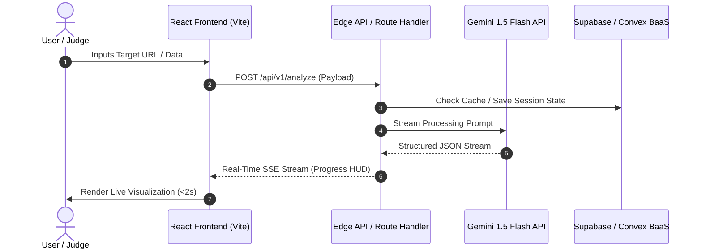

# Phase 4: Lean 7-Layer Architecture & Specification Suite

> **File:** `spec_universal/hackathon_pipeline/04_lean_7layer_architecture.md`  
> **Parent Protocol:** `00_master_hackathon_operating_system.md`  
> **Source Synthesis:** `Universal_Project_Boilerplate` (`spec_universal/hackathon_system_architecture.md`)  
> **Execution Mode:** High-signal, lean architectural modeling  
> **Designated Skills:** `spec-driven-development`, `api-and-interface-design`, `documentation-and-adrs`

---

## 🎯 Objective

Translate the scoped MVP from Phase 3 into a **lean, publication-grade architectural specification suite**. Instead of writing 50-page enterprise treatises, produce a unified, high-density architecture document covering all 7 pillars of system design: Product Definition, Tech Stack ADR, Macro Data Flow, Domain Model, Verification Harness, Demo Telemetry, and Instant Deployment.

---

## 🏗️ The Lean 7-Layer Architecture Suite

```yaml
lean_architecture_layers:
  layer_1_lean_prd:
    focus: "Target user, problem statement, quantitative success criteria, and strict non-goals."
    output_section: "Section 1: Product Requirements & Problem Statement"

  layer_2_tech_stack_adr:
    focus: "Architecture Decision Record selecting the fastest, zero-friction stack (BaaS over custom backend)."
    output_section: "Section 2: Technology Stack & Decision Records (ADRs)"

  layer_3_macro_data_flow:
    focus: "Single end-to-end Mermaid sequence diagram + strongly typed API request/response schemas."
    output_section: "Section 3: Macro Architecture & Typed API Contracts"

  layer_4_domain_model_and_state:
    focus: "Entity definitions, invariants, and deterministic State Machine transitions."
    output_section: "Section 4: Domain Model & State Transitions"

  layer_5_smoke_verification_plan:
    focus: "Defining compilation gates and the 2-minute Golden Demo Path smoke check with fail-safe fallbacks."
    output_section: "Section 5: Smoke Verification & Demo Reliability Plan"

  layer_6_demo_telemetry_and_sre:
    focus: "Lightweight in-app telemetry HUD showing live latency, token usage, and error boundaries to judges."
    output_section: "Section 6: Demo Telemetry & Visual SRE"

  layer_7_instant_deployment:
    focus: "Zero-downtime deployment topology on Vercel/Fly.io with pre-flight check."
    output_section: "Section 7: Deployment & Live Production URL"
```

---

## 📋 The Unified Architecture Specification Template

When Phase 4 executes, it generates a single authoritative architecture document: `spec/05_system_architecture.md`. Below is the required structure:

### Section 1: Lean Product Requirements (PRD)
```markdown
## 1. Product Requirements & Golden Path Scope

- **Target Persona:** [Specific user segment, e.g., Senior Full-Stack Engineer]
- **The Problem:** [Verifiable pain point mined from incumbent competitors in Phase 2]
- **The Core Solution:** [Baseline capability + Leverage Kill Feature]
- **Key Success Metric:** [e.g., Task completion time drops from 15 minutes to 3 seconds]
- **Strict Non-Goals:** [Features explicitly banned per Phase 3 Razor: No custom OAuth, no billing, no multi-tenant RBAC]
```

### Section 2: Technology Stack & ADR
Select the stack that minimizes boilerplate and maximizes live execution speed:

```yaml
recommended_hackathon_stack:
  frontend_framework: "Vite + React (TypeScript) or Next.js App Router"
  styling_and_ui: "Tailwind CSS + shadcn/ui + 21st.dev components + Lucide Icons"
  animation_and_polish: "Framer Motion (for smooth demo transitions)"
  backend_and_database: "Supabase (PostgreSQL + Auth + Realtime) or Convex (Zero-schema TypeScript BaaS)"
  ai_and_embeddings: "Google Gemini 1.5 Flash (@google/genai) for low-latency multimodal reasoning"
  deployment_platform: "Vercel / Cloudflare Pages / Railway for 1-click live URLs"
```

**Architecture Decision Record (ADR):**
- **Decision:** Use BaaS (e.g. Supabase / Convex) instead of building a custom Node/Python backend.
- **Rationale:** Eliminates hours spent configuring ORMs, migrations, and WebSocket servers.
- **Trade-off:** Vendor lock-in, which is acceptable and optimal for hackathons.

### Section 3: Macro Architecture & Typed API Contracts



**Typed TypeScript API Contract:**
```typescript
// Shared schema between Frontend and Backend
export interface AnalyzeRequest {
  targetUrl: string;
  options: {
    mode: 'fast' | 'deep';
    bypassCache?: boolean;
  };
}

export interface AnalyzeResponse {
  id: string;
  status: 'pending' | 'processing' | 'completed' | 'failed';
  baselineParityData: Record<string, unknown>;
  leverageKillFeatureData: {
    flawSolved: string;
    metrics: { speedup: string; rawOutput: string };
  };
  latencyMs: number;
}
```

### Section 4: Domain Model & State Transitions
Model the core entity as a deterministic Finite State Machine (FSM):

```
[IDLE] ---> (User Submits) ---> [ANALYZING]
                                     |
                +--------------------+--------------------+
                |                                         |
     (Success < 4s)                               (Timeout / Error)
                v                                         v
         [TRANSFORMING]                           [FALLBACK_FIXTURE]
                |                                         |
     (Leverage Applied)                           (Deterministic Mock)
                v                                         v
         [READY_TO_DEMO] <--------------------------------+
                |
     (User Clicks Export)
                v
          [EXPORTED]
```

### Section 5: Smoke Verification & Demo Reliability Plan
Map the verification steps directly to the Golden Demo Path:
- **Gate 1 (Compilation):** Verify clean build with zero TypeScript type or syntax errors (`npm run build` or `tsc --noEmit`).
- **Gate 2 (Golden Path Walkthrough):** Test that the landing view, 1-click preset button, and differentiating feature execute smoothly.
- **Fail-Safe Fallbacks:** Ensure that external API timeouts or errors gracefully switch to local mock fixtures (`src/mock/demo_fallback.json`).
- **Targeted Unit Tests (Exceptions Only):** Test only mission-critical mathematical or algorithmic logic where a silent calculation bug would break the demo. Enterprise 4-tier TDD and STRIDE threat testing are strictly disabled.

### Section 6: Demo Telemetry & Visual SRE
Judges love seeing technical maturity. Include a lightweight "System Status" or "Telemetry HUD" in the footer of your application:
- **Live Latency Counter:** Displays real-time API execution time (e.g., `⚡ Engine: 284ms`).
- **Token / Resource Tracker:** Displays tokens processed or memory allocated.
- **Circuit Breaker Status:** Shows green indicator for external API health.

### Section 7: Deployment & Live Production URL
- **Live Production URL:** Deploy to Vercel/Fly.io early (by Hour 8) so the live link can be tested throughout development.
- **Mobile Responsive Check:** Verify the UI looks clean on mobile devices in case judges view it on their phones.

---

## 🔒 Verification Checklist

Before starting frontend or backend implementation:
- [ ] Single consolidated specification generated at `spec/05_system_architecture.md`.
- [ ] Tech stack chosen prioritizes BaaS/Zero-Setup tools to maximize coding speed.
- [ ] Mermaid sequence diagram illustrates the entire Golden Demo Path.
- [ ] TypeScript interfaces define strict API request/response contracts.
- [ ] State transitions account for network errors and route gracefully to fallback fixtures.
- [ ] Run `graphify update .` to index the architectural contracts.
