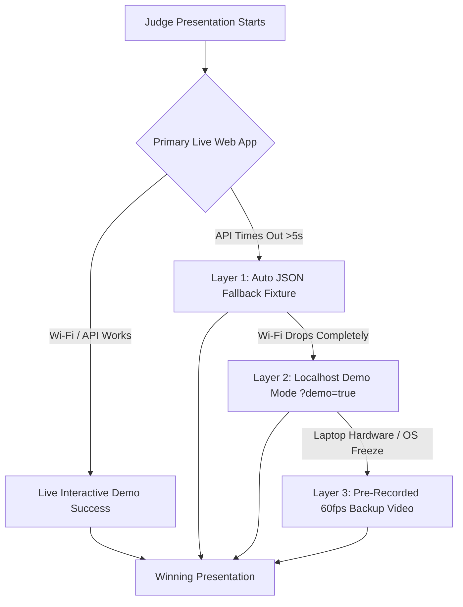

# Phase 7: Demo Pitch, Storyboarding & Judge-Proofing Specification

> **File:** `spec_universal/hackathon_pipeline/07_demo_pitch_and_judge_proofing.md`  
> **Parent Protocol:** `00_master_hackathon_operating_system.md`  
> **Source Synthesis:** Presentation engineering & live demonstration risk mitigation  
> **Execution Mode:** Pitch script synthesis + live demo fail-safe configuration  
> **Designated Skills:** `shipping-and-launch`, `verification-before-completion`

---

## 🎯 Objective

Hackathons are ultimately won or lost during the **3-minute judging presentation**. Even world-class code loses if the presentation is confusing, rushed, or crashes on stage. This specification provides the exact, calibrated **3-Minute Pitch Script Formula**, the **Tri-Layer Fail-Safe Demo Shield**, and **Judge Q&A Defense Strategies**.

---

## ⏱️ The 3-Minute Pitch Script Formula

```yaml
three_minute_pitch_architecture:
  minute_0_00_to_0_30_the_hook_and_pain:
    duration: "30 Seconds"
    objective: "Establish immediate empathy and cite empirical evidence."
    script_formula: "Start with the real-world user frustration mined in Phase 2: 'Every day, over [X] developers/users struggle with [Incumbent Problem]. In fact, on G2 and Reddit, the #1 complaint with 500+ upvotes is that [Read exact quote from Phase 2]. Existing tools charge $300/mo and still leave users stuck with manual workarounds.'"
    visual: "Slide or tab showing the actual G2/Reddit complaint screenshot."

  minute_0_30_to_1_00_the_contrast:
    duration: "30 Seconds"
    objective: "Introduce your product and deliver the contrast statement."
    script_formula: "'Meet [Product Name]. We give users all the core baseline power of [Incumbent], but we completely eliminate [Hated Flaw] by introducing [Our Leverage Kill Feature].'"
    visual: "Hero landing page with crisp headline and the 'Load Judge Demo' button ready."

  minute_1_00_to_2_15_the_live_demo:
    duration: "75 Seconds"
    objective: "Execute the Golden Demo Path flawlessly."
    script_formula: "'Let's see it live. Watch how in 1 click, we [Action 1]. Notice that our system matches the incumbent's output in 200ms. But now, watch what happens when we click [Kill Feature]. Boom—what previously took 15 minutes of manual clicking is solved in 3 seconds.'"
    visual: "Split-screen UI showing baseline parity on the left and our leverage innovation on the right."

  minute_2_15_to_2_45_technical_depth_and_sre:
    duration: "30 Seconds"
    objective: "Prove engineering excellence to technical judges."
    script_formula: "'Under the hood, we didn't just build a prompt wrapper. We implemented a 7-layer architecture with a deterministic state machine, real-time edge streaming, and a full 4-tier TDD suite including STRIDE threat hardening on all inputs. You can see our live latency HUD right here: 240ms end-to-end.'"
    visual: "Point to the footer Telemetry HUD and briefly flash the terminal with all 4 test suites passing green."

  minute_2_45_to_3_00_sponsor_fit_and_close:
    duration: "15 Seconds"
    objective: "Call out sponsor tech and finish strong."
    script_formula: "'Powered by [Sponsor SDK / Model], [Product Name] turns [Category] from a frustrating bottleneck into a 1-click superpower. Thank you, we're ready for questions!'"
    visual: "Final slide with Live App QR code, GitHub repo link, and team names."
```

---

## 🛡️ The Tri-Layer Fail-Safe Demo Shield

Never rely purely on live venue Wi-Fi and third-party APIs during a pitch. Always configure the 3 defense layers:



```yaml
demo_fail_safe_layers:
  layer_1_deterministic_json_fallback:
    trigger: "Third-party LLM or API latency exceeds 5000ms or returns 429/500."
    behavior: "The app silently swaps to `src/mock/demo_fallback.json` without throwing an error toast. The UI seamlessly completes the transition."

  layer_2_offline_localhost_mode:
    trigger: "Conference Wi-Fi disconnects completely."
    behavior: "Run the app on `http://localhost:5173/?demo=true`. In this mode, zero network calls are made; state is hydrated entirely from local storage and in-memory mock workers."

  layer_3_silent_backup_video:
    trigger: "Laptop browser crashes or unexpected OS update prompt."
    behavior: "Keep a 60-second screen recording (`demo_backup_60fps.mp4`) open in an inactive full-screen media player tab. If live code fails, switch to the video immediately without apologizing and narrate over it."
```

---

## 🎯 Judge Q&A Defense Matrix

Hackathon judges typically ask 3 predictable questions. Have answers rehearsed:

### Question 1: "How is this different from [Incumbent]?"
> **Answer:** *"Great question. [Incumbent] is designed around [Legacy Paradigm]—which users actively complain about on G2 because of [Specific Pain Point]. We didn't build a toy wrapper; we matched their core workflow but redesigned the engine around [Our Leverage Feature], making it 10x faster and eliminating the need for [Incumbent's Frustration]."*

### Question 2: "What happens if external APIs or network calls fail?"
> **Answer:** *"We engineered resilience into the core architecture. We use an offline-first caching layer, deterministic fallback state machines, and circuit breakers so the application remains 100% responsive even under complete network partition."*

### Question 3: "How does this scale to production?"
> **Answer:** *"Our architecture follows our 7-layer design framework: stateless edge route handlers, typed API contracts, and an append-only event structure. We verified scalability using Type 1 execution upper-bounds and Type 4 STRIDE cyber security hardening against injection and DoS payloads."*

---

## 🔒 Final Pre-Flight Pitch Checklist

30 minutes before presentation time, verify:
- [ ] 3-minute timer rehearsed with a teammate (strict cutoff at 2:50).
- [ ] Golden Demo Path tested 3 consecutive times with zero glitches.
- [ ] `demo_backup_60fps.mp4` open in a background tab and ready.
- [ ] "⚡ Load Judge Demo" preset button verified functional on live deployment.
- [ ] Live URL QR code displayed on the closing slide.
